# 04 数据模型

整理日期：2026-09-30。数据库 PostgreSQL，表定义用 Drizzle（`server/db/schema`，一张表一个 `pgTable`），迁移由 Drizzle Kit 生成。枚举和字段规则（手机号格式、金额非负、数量为正等）只在 `shared` 定义，表结构的 `pgEnum`、`CHECK` 和 `shared/contract` 的请求、响应结构都引用它（05 第 1.1 节）。

依据：冻结原型 `huazhong-unified`（提交 5dd7d7c）各模块的真实字段；业务规则见 03 章，本文不复述。不参考老小程序代码。本文只写字段、约束和算法，不写完整代码。

## 1. 公共约定

| 项 | 规则 |
|---|---|
| 表名 | snake_case 复数，例如 `purchase_orders`；接口字段格式见 00 章第 3 节 |
| 主键 | `id BIGINT GENERATED ALWAYS AS IDENTITY`（Drizzle：`bigint('id',{mode:'number'}).primaryKey().generatedAlwaysAsIdentity()`）。接口用 `id` 取数，界面显示 `no`；接口格式见 00 章第 3 节 |
| 单号 `no` | `TEXT NOT NULL UNIQUE`，格式见 `shared/config` 的 `DOC_NO_FORMAT`（例如 `SO-260930-001`）；按 `Asia/Shanghai` 日期由 `doc_sequences` 发号，超过 999 自然变 4 位 |
| 乐观锁 | 会被修改的单据有 `version INTEGER NOT NULL DEFAULT 1`，每次写 +1；更新带 `WHERE id=? AND version=?`，影响 0 行返回 `STALE` |
| 时间 | `created_at`、`updated_at TIMESTAMPTZ(3) NOT NULL DEFAULT now()`；业务日期（下单、出货、入库、收付款日期）用 `DATE`；「今天」按 `Asia/Shanghai` 算 |
| 操作人 | `created_by BIGINT NOT NULL → accounts.id`；各动作另有 `*_by`、`*_at`（例如 `shipped_by`、`shipped_at`） |
| 金额 | 整数「分」，列名 `*_cents INTEGER`，每列有 `CHECK`；合计在查询里按 `BIGINT` 求和 |
| 数量 | `INTEGER` + `CHECK`（原型所有数量都是整数） |
| 名称快照 | 单据明细存 `name`、`unit` 快照（原型就是这样），主数据改名、改单位不影响历史单据 |
| 主数据 | 只停用不删除（`enabled BOOLEAN NOT NULL DEFAULT true`）；外键一律 `ON DELETE RESTRICT` |
| 状态 | PostgreSQL 原生 enum（Drizzle `pgEnum`）存英文码；英文码和中文名只在 `shared` 包定义，`pgEnum` 直接取 `shared` 的枚举值，见第 2 节 |
| 例外 | 复合主键的支撑表（`account_modules`、`doc_sequences`、`idempotency_keys`）只有各自列出的字段；只插入的表（`operation_logs`、`stock_moves`）没有 `updated_at` |
| JSONB | 只用在变更记录、改价记录的 `items`，盘点单的分类快照，日志的 `before`、`after`；其余都是独立表 |
| 算出来的值 | 往来未收 / 待付、未结清、未对账、多收 / 多付余额、逾期、库存、库龄、在途、可申请售后数量和 `actions`、`lockedReason` 都不存，按第 8 节查询时算；对账单开单金额和来源快照保存，业务单据不保存收付款状态 |
| 业务参数 | 上限、有效期、分页、编码前缀等只引用 `shared/config` 的配置名（05 第 1.6 节），本文不写数字 |

`INTEGER` 持久化金额、单价和数量的输入上限统一引用 `shared/rules` 的 `STORED_INT_MAX`，越界返回字段级 `VALIDATION_FAILED`；售后保存总额也必须在该存储范围内。这是当前列类型的技术边界，不新增业务额度规则。派生金额、库存等汇总不套用单列上限：SQL 乘法先转 `BIGINT` 再求和，映射及后端累计必须保持 JavaScript 安全整数；超出精确表示范围拒绝计算，不静默舍入。

下文每张表都含公共列：`id`、`created_at`、`updated_at`、`created_by`；标「有版本」的另含 `version`。表格里不再重复。

单号前缀：

| 前缀 | 单据 | 前缀 | 单据 |
|---|---|---|---|
| SO | 订单 | RK | 手工入库单 |
| AS | 售后 | CK | 手工出库单 |
| PO | 采购单 | BS | 报损单 |
| YQ | 填报邀请 | PD | 盘点单 |
| SK | 收款 | FK | 付款 |
| TK | 多收退回、多付退回 | DZ | 客户 / 供应商对账单 |

对账单明细、结清关联、多收抵扣来源、退货、库存批次、出入库流水没有单号，只用 `id`。

## 2. 枚举码与中文名

中文名以 03 章第 3 节为准。前端只显示中文名，接口传英文码。

| enum | 英文码 → 中文 |
|---|---|
| `order_status` | `pending_confirm` 待确认、`to_ship` 待发货、`shipped` 已发货、`cancelled` 已取消、`voided` 已作废 |
| `cancel_request_status` | `pending` 待处理、`approved` 已同意、`rejected` 已拒绝、`withdrawn` 已撤回、`lapsed` 已失效 |
| `order_origin` | `store` 门店下单、`sales` 销售新建 |
| `store_invite_status` | `pending` 待使用、`used` 已使用、`expired` 已过期、`voided` 已作废 |
| `after_status` | `pending` 待处理、`processed` 已处理、`closed` 已关闭、`voided` 已作废 |
| `after_origin` | `store` 门店提交、`sales` 销售新建 |
| `after_reason` | `damaged` 花材损坏、`qty_mismatch` 数量不符、`quality` 品质问题、`other` 其他 |
| `record_status`（收款、付款、退款共用） | `valid` 有效、`voided` 已作废 |
| `statement_kind` | `customer` 客户对账单、`supplier` 供应商对账单 |
| `statement_status` | `unsettled` 未结清、`settled` 已结清、`voided` 已作废；没有部分结清 |
| `refund_kind` | `receipt` 多收退回、`payment` 多付退回 |
| `invite_status` | `pending` 待填报、`submitted` 已提交、`cancelled` 已取消 |
| `po_status` | `to_receive` 待收货、`received` 已收货、`rejected` 已拒收、`cancelled` 已取消、`voided` 已作废 |
| `wh_doc_kind` | `in` 手工入库、`out` 手工出库、`loss` 报损 |
| `wh_doc_status` | `stocked_in` 已入库、`stocked_out` 已出库、`lost` 已报损、`voided` 已作废 |
| `stocktake_status` | `done` 已盘点 |
| `move_type` | `po_in` 采购入库、`po_return` 采购退货、`po_void` 采购单作废、`manual_in` 手工入库、`in_void` 入库作废、`manual_out` 手工出库、`out_void` 出库作废、`loss` 报损、`loss_void` 报损作废、`check_gain` 盘盈、`check_loss` 盘亏 |
| `account_type` | `admin` 管理员、`staff` 员工、`store` 门店、`supplier` 供应商 |
| `module_key` | `sales` 销售、`shipping` 发货、`purchase` 采购、`warehouse` 仓库、`finance` 财务 |
| `file_status` | `pending` 待检测、`ok` 通过、`rejected` 不通过 |

算出来、不存库的状态（接口里以英文码返回，中文名同样在 `shared`）：

| 名称 | 英文码 → 中文 | 算法见 |
|---|---|---|
| 采购需求 | `invited` 已邀请（缺货 / 够用由 `leftQty` 正负得出，不另返回）；`shipFrom`、`shipTo` 这种花材涉及订单的最早、最晚出货日期 | 第 8 节 |
| 采购单标记 | `changed` 改单、`repriced` 改价、`all_returned` 已全部退货 | 有记录即为真 |
| 订单标记 | `changed` 改单、`repriced`（明细单价 ≠ 目录价）、`cancelRequested`（有待处理的取消申请）、`shortShipped` 少发、`overShipped` 多发（有一行实发少于、多于订单数量） | 同上 |
| 订货目录 | `off` 停用（`catalog_items.enabled=false`） | — |

状态标签颜色见 02 章，和中文名一起放在 `shared` 的状态表里。

外部端（门店、供应商）不出现「已作废」（2026-10-03 改版）：订单、采购单、售后的 `voided` 照常存储和返回，门店端、供应商端显示成「已取消」、原因行写「取消原因」；员工端照常显示已作废（03 章第 3 节、05 章）。

## 3. 账号与公共

### 3.1 `accounts` 账号（有版本）

员工、管理员、门店账号、供应商账号都在这一张表。供应商账号只存这一份（原型在采购供应商资料和公共用户表各存一份）。

| 字段 | 类型与约束 | 说明 | 原型字段 |
|---|---|---|---|
| type | `account_type NOT NULL` | 管理员、员工、门店、供应商 | `admin`、`type` |
| name | `TEXT NOT NULL` | 姓名 | `name` |
| phone | `TEXT NOT NULL CHECK (phone ~ '^1[0-9]{10}$')` | 登录手机号。员工、门店、供应商账号都必填，由管理员、销售（门店资料）、采购（供应商资料）预先录入；启用账号里唯一 | `phone`、`loginPhone` |
| openid | `TEXT NULL` | 首次手机号快速验证后绑定；退出登录（= 解绑）或销售、管理员解绑时清空，下次重新手机号验证。门店账号已绑定微信时，新邀请不能再绑 | 无 |
| store_id | `BIGINT NULL → stores.id` | 门店账号必填 | `store` |
| supplier_id | `BIGINT NULL → suppliers.id` | 供应商账号必填 | `supplier` |
| enabled | `BOOLEAN NOT NULL DEFAULT true` | 停用后不能登录。门店账号还要看 `stores.enabled`，供应商账号还要看 `suppliers.enabled`：门店或供应商停用，关联账号同样不能登录（守卫每次请求都查） | `enabled` |
| bound_at | `TIMESTAMPTZ(3) NULL` | 绑定微信时间 | 无 |

约束：`CHECK ((type='store') = (store_id IS NOT NULL))`、`CHECK ((type='supplier') = (supplier_id IS NOT NULL))`。

第一个管理员没有人创建它：插入时先从 `accounts_id_seq` 取号，`id` 和 `created_by` 都写这个号（`OVERRIDING SYSTEM VALUE`），其余账号的 `created_by` 是真实的操作人。

索引：部分唯一 `(phone) WHERE enabled`；部分唯一 `(openid) WHERE openid IS NOT NULL`；部分唯一 `(store_id) WHERE type='store' AND enabled`（一店一账号）；部分唯一 `(supplier_id) WHERE type='supplier' AND enabled`（一家一个供应商账号）。

门店账号显示的组织名「客户 · 门店」、供应商账号的组织名都从关联表取，不另存（原型的 `org`）。

### 3.2 `account_modules` 员工模块

| 字段 | 类型与约束 | 说明 | 原型字段 |
|---|---|---|---|
| account_id | `BIGINT NOT NULL → accounts.id` | 只允许 `type='staff'`（服务层校验） | `modules[]` |
| module | `module_key NOT NULL` | | |

主键 `(account_id, module)`。管理员不写这张表，默认全部模块。多模块员工权限取并集。

### 3.3 `operation_logs` 操作日志

只插入，不更新、不删除。在业务事务里一起写。

| 字段 | 类型与约束 | 说明 | 原型字段 |
|---|---|---|---|
| module | `module_key NULL` | 门店端的操作记在 `sales`，供应商端的记在 `purchase`（原型如此）；账号类操作（绑定、解绑微信，新建、修改员工）为 `NULL`，界面叫「公共」，只有管理员能看（03 章第 8.5 节） | `module` |
| kind | `TEXT NOT NULL` | 对象类别，例如「订单」「售后」「采购到货」 | `kind` |
| action | `TEXT NOT NULL` | 例如「确认订单」「作废售后」 | `action` |
| target_type | `TEXT NOT NULL` | 表名，例如 `orders` | 无 |
| target_id | `BIGINT NULL` | | 无 |
| target_label | `TEXT NOT NULL` | 单号或对象名，用于列表显示 | `target` |
| actor_label | `TEXT NOT NULL` | 快照：员工是姓名；外部账号写「门店 滨江店」「供应商 春禾花材」，不写岗位；自动动作是「系统」 | `actor` |
| reason | `TEXT NOT NULL DEFAULT ''` | | `reason` |
| before | `JSONB NULL` | 修改前的业务视图（中文名、元为单位都可以，只用于展示） | `before` |
| after | `JSONB NULL` | 修改后 | `after` |

`created_by` 在自动动作时可空。员工只看自己做过的全部非公共操作（`created_by` = 本人且 `module IS NOT NULL`），调岗前的也保留；模块筛选只缩小这个范围，不能替换本人条件。管理员看全部（2026-10-02 交叉审查确认）。索引：`(module, created_at DESC)`、`(created_by, created_at DESC)`、`(target_type, target_id)`。

### 3.4 其他公共表

| 表 | 字段 | 约束和说明 |
|---|---|---|
| `doc_sequences` | `prefix TEXT`、`day DATE`、`last INTEGER NOT NULL` | 主键 `(prefix, day)`。发号：`INSERT … VALUES (?, ?, 1) ON CONFLICT (prefix, day) DO UPDATE SET last = doc_sequences.last + 1 RETURNING last`，和业务写入在同一事务里 |
| `idempotency_keys` | `account_id`、`key TEXT`、`endpoint TEXT`、`response JSONB NULL`、`created_at` | 主键 `(account_id, key)`。事务一开始先插入这一行占住键（并发的同一键会等前一个事务结束），业务写完在同一事务里填 `response`；同一键重复提交直接返回上次结果，换了接口返回 `VALIDATION_FAILED`；保留 `IDEMPOTENCY_TTL_HOURS`（`shared/config`），pg-boss 每天清理 |
| `files` | `purpose TEXT`（after_image / product_image / loss_image）、`cos_key TEXT UNIQUE`、`thumb_key TEXT NULL`、`size_bytes INTEGER CHECK (size_bytes > 0)`、`mime TEXT`、`status file_status`、`uploaded_by` | 上传完成登记；内容安全检测结果写 `status`，业务表只能引用 `status='ok'` 且用途、上传人符合权限的文件 |

## 4. 销售、门店端、发货

### 4.1 主数据

| 表 | 字段（类型与约束） | 说明 | 原型字段 |
|---|---|---|---|
| `customers` | `name TEXT NOT NULL UNIQUE`、`enabled`、`term_days INTEGER NULL CHECK (term_days >= 0)`、`opening_debt_cents INTEGER NOT NULL DEFAULT 0 CHECK (opening_debt_cents >= 0)`、有版本 | 客户（往来单位），对账按客户、明细按门店。销售维护名称、启用状态；财务维护账期和期初欠款。期初欠款只在开第一张对账单前可改，首张有效对账单保存该金额；首张作废后释放期初欠款占用，下一张重新带入，不重复计算 | `customers[]` |
| `stores` | `customer_id → customers.id NOT NULL`、`name TEXT NOT NULL`、`contact`、`phone`、`address` 都是 `TEXT NOT NULL DEFAULT ''`、`enabled`、有版本 | 唯一 `(customer_id, name)`。填了登录手机号（有启用的门店账号）时 `contact` 不能为空，门店账号的 `accounts.name` 跟着 `contact` 改（服务层，同一事务）。停用规则见 03 章第 2、5 节 | `stores[]` |
| `product_categories` | `name TEXT NOT NULL UNIQUE`、`sort INTEGER NOT NULL DEFAULT 0` | 产品内部分类（单品、花束…），只在产品管理里用（2026-10-03 确认）。按 `sort, id` 排；没有产品（含停用的产品）时可以删除（03 章第 5 节） | `cats[]` |
| `products` | `name TEXT NOT NULL UNIQUE`、`category_id → product_categories.id`、`unit TEXT NOT NULL`、`image_file_id → files.id NULL`、`enabled`、有版本 | 成品。停用规则见 03 章第 5 节；原型没有产品级启用，新加 | `products[]` |
| `product_bom_lines` | `product_id → products.id`、`material_id → materials.id`、`qty INTEGER NOT NULL CHECK (qty > 0)` | 配方，唯一 `(product_id, material_id)`；每个产品至少一行（服务层）。直接关联花材，原型的「配方对不上花材资料」在新版不会出现 | `bom[]` |
| `catalog_categories` | `customer_id → customers.id`、`name TEXT NOT NULL`、`sort INTEGER NOT NULL DEFAULT 0` | 订货分类：每个客户一套，门店订货页按它分组（2026-10-03 确认）。唯一 `(customer_id, name)`；按 `sort, id` 排；有目录产品（含停用的）时不能删 | — |
| `catalog_items` | `customer_id → customers.id`、`product_id → products.id`、`category_id → catalog_categories.id NOT NULL`、`customer_code TEXT NOT NULL DEFAULT ''`、`price_cents INTEGER NOT NULL CHECK (price_cents >= 0)`、`enabled`、有版本 | 订货目录：每个客户一份价目。唯一 `(customer_id, product_id)`；`customer_code` 是客户产品编码（`''` 为没填），部分唯一索引 `(customer_id, customer_code) WHERE customer_code <> ''`；`category_id` 须是同一客户的分类（服务层校验），索引 `(category_id)`。`enabled=false` 即停用。改 `price_cents` 时同一事务更新这个客户待确认订单里这种产品的 `order_lines.price_cents`、`list_price_cents`（03 章第 8.1 节） | `directory[客户][]` |

### 4.2 `orders` 订单（有版本）

| 字段 | 类型与约束 | 说明 | 原型字段 |
|---|---|---|---|
| no | `TEXT NOT NULL UNIQUE` | SO-… | `id` |
| order_date | `DATE NOT NULL` | 下单日期 = 录入那天（服务端写），门店和销售都不能改 | `date` |
| ship_date | `DATE NULL` | 出货日期，由销售定：门店下的单待确认时为空，确认订单、修改并确认时写入；销售可以选今天以前（补录） | `ship` |
| customer_id | `→ customers.id NOT NULL` | | `customer` |
| store_id | `→ stores.id NOT NULL` | 必须属于 customer_id（服务层校验） | `store` |
| status | `order_status NOT NULL` | | `status` |
| origin | `order_origin NOT NULL` | | `origin` |
| note | `TEXT NOT NULL DEFAULT ''` | 门店或销售写的备注 | `note` |
| confirmed_by / confirmed_at | `NULL` | 销售确认（含修改并确认） | 无 |
| shipped_by / shipped_at | `NULL` | 确认发货 | `shipper`、`shippedAt` |
| ship_note | `TEXT NOT NULL DEFAULT ''` | 有一行实发和订单数量不一致（少发、多发）时必填（服务层校验） | `shipNote` |
| cancelled_by / cancelled_at | `NULL` | 同意门店取消申请时是同意的销售 | 无 |
| cancel_reason | `TEXT NULL` | 取消原因；待确认取消时为空；同意取消申请时写「门店申请取消」，门店写了原因接在后面 | `closeReason` |
| void_reason / voided_by / voided_at | `NULL` | 作废已发货订单（必填原因） | 无 |

约束：`CHECK (status <> 'shipped' OR shipped_at IS NOT NULL)`、`CHECK (status <> 'pending_confirm' OR ship_date IS NULL)`、`CHECK (status NOT IN ('to_ship','shipped','voided') OR ship_date IS NOT NULL)`、`CHECK (status <> 'voided' OR (shipped_at IS NOT NULL AND void_reason IS NOT NULL))`。索引：`(status, ship_date)`、`(store_id, order_date DESC)`、`(customer_id, status)`。

状态流转：门店下单 → `pending_confirm`；销售新建 → `to_ship`；`pending_confirm` → `to_ship`（确认、修改并确认，同时写 `ship_date`）；`to_ship` → `shipped`（确认发货）；`pending_confirm`、`to_ship` → `cancelled`（含同意取消申请）；`shipped` → `voided`（作废已发货订单，前提见 03 章第 5 节）。

「归属」（03 章第 2 节，判断谁能取消、作废）：`origin='sales'` 归 `created_by`；门店下的单确认后归 `confirmed_by`，待确认时任何销售。

### 4.3 `order_lines` 订单明细

| 字段 | 类型与约束 | 说明 | 原型字段 |
|---|---|---|---|
| order_id | `→ orders.id NOT NULL ON DELETE CASCADE` | 改单时整组替换 | |
| product_id | `→ products.id NOT NULL` | 唯一 `(order_id, product_id)` | `product` |
| name / unit | `TEXT NOT NULL` | 快照 | `name`、`unit` |
| customer_code | `TEXT NOT NULL DEFAULT ''` | 下单时的客户产品编码快照（2026-10-03 确认）；没填为 `''`，之后改目录编码不变 | — |
| qty | `INTEGER NOT NULL CHECK (qty > 0)` | 订货数量 | `qty` |
| price_cents | `INTEGER NOT NULL CHECK (price_cents >= 0)` | 下单单价，销售可改（改过的标「改价」）；待确认订单始终等于目录价，随目录调价同步 | `price` |
| list_price_cents | `INTEGER NOT NULL CHECK (list_price_cents >= 0)` | 下单时的目录价快照；待确认订单随目录调价同步 | `listPrice` |
| shipped_qty | `INTEGER NULL CHECK (shipped_qty >= 0)` | 实发；可少于或多于订单数量，不设上限（2026-10-02 梳理确认）；确认发货时写，之后不能改 | `shipped` |
| sort | `INTEGER NOT NULL` | 显示顺序 | 数组下标 |

### 4.4 `order_changes` 订单变更记录

| 字段 | 类型与约束 | 说明 | 原型字段 |
|---|---|---|---|
| order_id | `→ orders.id NOT NULL` | | |
| actor_label | `TEXT NOT NULL` | 快照 | `changes[].actor` |
| reason | `TEXT NOT NULL DEFAULT ''` | 门店改单为空；销售改单、修改并确认必填 | `changes[].reason` |
| items | `JSONB NOT NULL` | 字符串数组，例如 `["粉玫瑰日常花束 数量 15 → 18","出货日期 2026-09-29 → 2026-09-30"]`；内容没变不写记录；确认订单时第一次写出货日期、目录调价同步单价都不写 | `changes[].items` |

索引 `(order_id, created_at)`。有记录即卡片标「改单」。

### 4.4a `order_cancel_requests` 门店取消申请（2026-10-02 梳理确认）

| 字段 | 类型与约束 | 说明 |
|---|---|---|
| order_id | `→ orders.id NOT NULL` | 只能对 `to_ship` 订单提交 |
| status | `cancel_request_status NOT NULL DEFAULT 'pending'` | |
| reason | `TEXT NOT NULL DEFAULT ''` | 门店原因，选填 |
| requested_by / requested_at | `NOT NULL` | 门店账号 |
| handled_by / handled_at | `NULL` | 销售同意、拒绝；撤回时为门店账号；失效时为确认发货的人 |
| reject_reason | `TEXT NULL` | 拒绝必填；`CHECK (status <> 'rejected' OR reject_reason IS NOT NULL)` |

部分唯一 `(order_id) WHERE status='pending'`（同一时间只有一条待处理）。有 `rejected` 记录的订单不能再申请（服务层校验）。确认发货时同一事务把 `pending` 改成 `lapsed`。订单详情列出全部历史申请。索引 `(status, requested_at)`。

申请、撤回、同意、拒绝、发货失效均在锁住订单并复查 `orders.version` 后写入，同一事务提升订单版本（与发货、取消本身的版本更新合并一次）。申请表不另设版本；旧版本不能处理撤回后新建的申请。

### 4.5 `afters` 售后（有版本）

| 字段 | 类型与约束 | 说明 | 原型字段 |
|---|---|---|---|
| no | `TEXT NOT NULL UNIQUE` | AS-… | `id` |
| after_date | `DATE NOT NULL` | 提交日期 | `date` |
| order_id | `→ orders.id NOT NULL` | 必须是已发货订单（服务层校验） | `order` |
| customer_id / store_id | `NOT NULL` | 冗余自订单，便于按门店、客户查 | `customer`、`store` |
| status | `after_status NOT NULL` | | `status` |
| origin | `after_origin NOT NULL` | 门店提交 → `pending`；销售新建直接 `processed` | `origin` |
| amount_cents | `INTEGER NULL CHECK (amount_cents >= 0)` | 处理后写入 = Σ 行金额；待处理为空 | `amount` |
| note | `TEXT NOT NULL DEFAULT ''` | 处理说明，选填 | `note` |
| processed_by / processed_at | `NULL` | | 无 |
| close_reason | `TEXT NULL` | 关闭原因（必填） | `closeReason` |
| void_reason / voided_by / voided_at | `NULL` | 作废（必填原因） | `voidReason`、`voidAt` |

约束：`CHECK (status <> 'processed' OR amount_cents IS NOT NULL)`、`CHECK (status <> 'voided' OR void_reason IS NOT NULL)`。索引：`(order_id, status)`、`(store_id, after_date DESC)`、`(status, after_date DESC)`。

状态流转：`pending` → `processed` / `closed`；`processed` → `voided`。

售后详情的 `closedAt` 只投影该售后对应「关闭售后」日志的真实时间，不新增实体列；未关闭或历史缺少关闭日志时为 null，不用申请日期替代。关闭写入和日志在同一事务内，响应立即带关闭时间。

### 4.6 `after_lines` 售后明细

| 字段 | 类型与约束 | 说明 | 原型字段 |
|---|---|---|---|
| after_id | `→ afters.id NOT NULL ON DELETE CASCADE` | | |
| order_line_id | `→ order_lines.id NOT NULL` | 挂在原发货单的这一行；唯一 `(after_id, order_line_id)` | `product` |
| name / unit | `TEXT NOT NULL` | 快照 | `name`、`unit` |
| requested_qty | `INTEGER NULL CHECK (requested_qty > 0)` | 门店原始申请数量：门店提交时写入，处理时不覆盖；销售新建的售后为空 | 无（原型处理时覆盖 `qty`） |
| qty | `INTEGER NOT NULL CHECK (qty >= 0)` | 售后数量：门店提交时 = `requested_qty`；销售处理门店售后时改这一列，可以填 0，服务层校验至少一行 > 0 | `qty` |
| price_cents | `INTEGER NOT NULL CHECK (price_cents >= 0)` | 默认发货单价，只能改低（服务层对 `order_lines.price_cents` 校验） | `price` |
| reason | `after_reason NOT NULL` | 门店提交的售后只读 | `reason` |
| description | `TEXT NOT NULL DEFAULT ''` | 问题说明；门店提交时必填，销售新建时选填 | `description` |
| sort | `INTEGER NOT NULL` | | 下标 |

行金额 = `qty × price_cents`，整数不需要四舍五入。原型的 `max`（可申请数量）不存，按第 8 节现算。

### 4.7 `after_line_images` 售后图片

| 字段 | 类型与约束 | 说明 | 原型字段 |
|---|---|---|---|
| after_line_id | `→ after_lines.id NOT NULL ON DELETE CASCADE` | | |
| file_id | `→ files.id NOT NULL` | 只能引用 `purpose='after_image' AND status='ok'` | `images[]` |
| sort | `SMALLINT NOT NULL` | | |

只有门店提交的售后有图片，销售新建的不带。门店提交时四种原因均需问题说明且每行至少 1 张图片（服务层校验）。唯一 `(after_line_id, file_id)`；每行最多 `AFTER_IMAGE_MAX_COUNT` 张（服务层校验，单张 ≤ `IMAGE_MAX_BYTES` 在签名时限制，配置在 `shared/config`）。

### 4.8 `store_invites` 门店邀请（邀请订货）

销售给门店生成分享邀请，门店打开后用手机号快速验证绑定门店账号。同一门店同一时间只有一条有效邀请；门店账号已绑定微信时不能再用邀请绑定，要销售或管理员先在门店资料里解绑。

| 字段 | 类型与约束 | 说明 | 原型字段 |
|---|---|---|---|
| store_id | `→ stores.id NOT NULL` | 邀请哪家门店 | 无 |
| token_hash | `TEXT NOT NULL UNIQUE` | 分享路径里带随机 token（`STORE_INVITE_TOKEN_BYTES` 字节），库里只存 SHA-256 | 无 |
| expires_at | `TIMESTAMPTZ(3) NOT NULL` | 生成时间 + `STORE_INVITE_TTL_DAYS` 天 | 无 |
| status | `store_invite_status NOT NULL DEFAULT 'pending'` | 绑定成功 → `used`；过期 → `expired`；同一门店重新生成邀请时，旧的待使用邀请改成 `voided`（使用时按 `expires_at` 判断，pg-boss 每天把过期的改成 `expired`） | 无 |
| bound_account_id | `→ accounts.id NULL` | 绑定的门店账号 | 无 |
| bound_at | `TIMESTAMPTZ(3) NULL` | 绑定时间 | 无 |

约束：`CHECK ((status='used') = (bound_at IS NOT NULL))`。索引：`(store_id, created_at DESC)`；部分唯一 `(store_id) WHERE status='pending'`（同一门店只有一条待使用）。

状态流转：`pending` → `used`（手机号和门店账号登录手机号一致，绑定成功）/ `expired` / `voided`（重新生成邀请时自动作废）。用过、过期、作废都失效。

## 5. 采购、供应商端

### 5.1 `suppliers` 供应商（有版本）

| 字段 | 类型与约束 | 说明 | 原型字段 |
|---|---|---|---|
| name | `TEXT NOT NULL UNIQUE` | 必填不重复 | `name` |
| contact / phone / address | `TEXT NOT NULL DEFAULT ''` | | `contact`、`phone`、`address` |
| enabled | `BOOLEAN NOT NULL DEFAULT true` | 停用后已下的单照常收货付款；待填报邀请自动取消 | `enabled` |
| term_days | `INTEGER NULL CHECK (term_days >= 0)` | 账期天数；空值不生成付款截止、不算逾期 | — |
| opening_debt_cents | `INTEGER NOT NULL DEFAULT 0 CHECK (opening_debt_cents >= 0)` | 财务维护的期初欠款，仅开首张对账单前可改；首张有效对账单保存，作废释放占用 | — |

供应商账号在 `accounts`（`type='supplier'`），是否开通 = 有一条启用的供应商账号（原型的 `account`、`loginPhone`）。

修改供应商账号登录手机号时，同一事务清空 `openid`、`bound_at` 并提升账号版本；供应商资料版本也提升（阶段 4 确认）。

停用供应商或关闭供应商账号时保留原账号及其 `openid`、`bound_at`，更新状态并提升账号和供应商版本；重新启用同一账号后原微信可继续使用。若同时修改登录手机号，仍清空微信绑定（阶段 4 确认）。

### 5.2 `purchase_orders` 采购单（有版本）

| 字段 | 类型与约束 | 说明 | 原型字段 |
|---|---|---|---|
| no | `TEXT NOT NULL UNIQUE` | PO-… | `id` |
| order_date | `DATE NOT NULL` | 下单日期 | `date` |
| supplier_id | `→ suppliers.id NOT NULL` | 填报生成的单不能改（服务层校验） | `supplier` |
| buyer_id | `→ accounts.id NOT NULL` | 采购员；填报生成的单是发邀请的人 | `buyer` |
| invite_id | `→ invites.id NULL UNIQUE` | 由填报生成时有值 | `invite` |
| status | `po_status NOT NULL` | | `status` |
| note | `TEXT NOT NULL DEFAULT ''` | | `note` |
| received_by / received_at | `NULL` | 确认收货或拒收 | `receiver`、`receivedAt` |
| recv_note | `TEXT NOT NULL DEFAULT ''` | | `recvNote` |
| cancel_reason / cancelled_by / cancelled_at | `NULL` | 取消原因必填；`cancelled_by` 可以是采购员或供应商账号 | `closeReason`、`cancelAt` |
| void_reason / voided_by / voided_at | `NULL` | 仓库作废已收货采购单（必填原因） | 无 |

原型的 `payable`、`repriced` 不存：采购金额按第 8 节算，改价看 `price_changes` 有没有记录；所属有效对账单通过 `statement_lines` 查询，业务单据没有已付 / 待付或付款状态。约束 `CHECK (status <> 'voided' OR (received_at IS NOT NULL AND void_reason IS NOT NULL))`。索引：`(status, order_date DESC)`、`(supplier_id, status)`。

状态流转：新建或填报提交 → `to_receive`；`to_receive` → `received`（实收有大于 0 的行）/ `rejected`（实收全 0）/ `cancelled`（采购取消，或供应商取消自己填报生成的单）；`received` → `voided`（仓库作废，前提见 03 章第 5 节，同一事务按净实收扣回库存，先扣本单批次）。

供应商改单、取消只限 `invite_id IS NOT NULL` 的单（2026-10-02 梳理确认）。

### 5.3 `purchase_order_lines` 采购明细

| 字段 | 类型与约束 | 说明 | 原型字段 |
|---|---|---|---|
| po_id | `→ purchase_orders.id NOT NULL ON DELETE CASCADE` | 收货前改单时整组替换 | |
| material_id | `→ materials.id NOT NULL` | 唯一 `(po_id, material_id)` | `material` |
| name / unit | `TEXT NOT NULL` | 快照 | `name`、`unit` |
| qty | `INTEGER NOT NULL CHECK (qty > 0)` | 采购数量 | `qty` |
| order_price_cents | `INTEGER NOT NULL CHECK (order_price_cents >= 0)` | 下单单价；0 = 赠送 | `orderPrice` |
| price_cents | `INTEGER NOT NULL CHECK (price_cents >= 0)` | 当前单价（仓库改价后变） | `price` |
| received_qty | `INTEGER NULL CHECK (received_qty >= 0)` | 实收，可多可少 | `received` |
| returned_qty | `INTEGER NOT NULL DEFAULT 0 CHECK (returned_qty >= 0)` | 累计退货，和 `purchase_returns` 在同一事务里更新；`CHECK (returned_qty <= COALESCE(received_qty,0))` | `returned` |
| sort | `INTEGER NOT NULL` | | 下标 |

### 5.4 改单、改价、退货记录

阶段 4 的 `price_changes` 只有非空 `po_id`；`wh_doc_id` 和单据二选一约束在阶段 5 随手工入库接入（阶段 4 确认）。

| 表 | 字段 | 说明 | 原型字段 |
|---|---|---|---|
| `po_changes` | `po_id NOT NULL`、`actor_label`、`reason TEXT NOT NULL DEFAULT ''`、`items JSONB NOT NULL`（字符串数组，含换供应商） | 采购改单、供应商改单的变更记录，三端可见，有记录即标「改单」；采购改单原因必填，供应商改单选填（服务层校验） | `changes[]` |
| `price_changes` | `po_id NULL`、`wh_doc_id NULL`、`actor_label`、`reason TEXT NOT NULL`、`items JSONB NOT NULL`（`[{name, fromCents, toCents}]`） | 采购单和手工入库单共用；`CHECK (num_nonnulls(po_id, wh_doc_id) = 1)`；收货时改价、收货后改价都写这里 | `priceChanges[]` |
| `purchase_returns` | `po_id NOT NULL`、`actor_label` | 一次退货一条，不用原因 | `returns[]` |
| `purchase_return_lines` | `return_id NOT NULL ON DELETE CASCADE`、`po_line_id NOT NULL`、`name`、`qty INTEGER CHECK (qty > 0)` | 每种花材累计不超过实收、库存（服务层校验） | `returns[].items[]` |

### 5.5 `invites` 填报邀请（有版本）

| 字段 | 类型与约束 | 说明 | 原型字段 |
|---|---|---|---|
| no | `TEXT NOT NULL UNIQUE` | YQ-… | `id` |
| invite_date | `DATE NOT NULL` | | `date` |
| supplier_id | `→ suppliers.id NOT NULL` | 必须有启用的供应商账号（服务层校验） | `supplier` |
| buyer_id | `→ accounts.id NOT NULL` | | `buyer` |
| status | `invite_status NOT NULL` | | `status` |
| submitted_at | `NULL` | | `submittedAt` |
| cancelled_by / cancelled_at | `NULL` | 自动取消时 `cancelled_by` 为空 | `cancelAt` |
| cancel_note | `TEXT NULL` | 自动取消写「停用供应商，自动取消」「关闭供应商账号，自动取消」 | `cancelNote` |

生成的采购单由 `purchase_orders.invite_id` 反查。索引：`(status, supplier_id)`。

阶段 4 确认：停用花材不删除 `invite_lines` 需求快照。提交只校验实际提交行（邀请行和另报行）的花材启用状态；供应商删除停用行后直接提交，缺少的邀请行算「未供」，不写 `invite_supply_lines` / 采购单明细。`cancelled_at` 在详情返回 `cancelledAt`，用于手动 / 自动取消原因行。

填报分享链接不另存表：路径带邀请号和 HMAC 签名（只签邀请 ID），不设有效期；邀请不是 `pending`（已提交、已取消）就失效，只有这家供应商的账号能打开。

状态流转：`pending` → `submitted`（供应商提交，同一事务生成采购单）/ `cancelled`（采购取消，或停用供应商、关闭账号时自动取消）。

| 表 | 字段 | 说明 | 原型字段 |
|---|---|---|---|
| `invite_lines` | `invite_id NOT NULL ON DELETE CASCADE`、`material_id`、`name`、`unit`、`need_qty INTEGER CHECK (need_qty > 0)`、`sort` | 需求花材，唯一 `(invite_id, material_id)`；待填报时可整组替换 | `lines[].need` |
| `invite_supply_lines` | `invite_id NOT NULL`、`material_id`、`name`、`unit`、`qty INTEGER CHECK (qty > 0)`、`price_cents INTEGER CHECK (price_cents >= 0)`、`sort` | 供应商提交时的供货快照（可另报花材），之后采购单改单不影响它 | `supply[]` |

## 6. 仓库

### 6.1 主数据

阶段 4 只使用花材分类和花材；`out_categories` 随手工出库在阶段 5 接入（阶段 4 确认）。

| 表 | 字段（类型与约束） | 说明 | 原型字段 |
|---|---|---|---|
| `material_categories` | `name TEXT NOT NULL UNIQUE`、`sort INTEGER NOT NULL DEFAULT 0` | 花材分类，可新建、改名（改名只改这一行，花材跟着变） | `cats[]` |
| `materials` | `code TEXT NOT NULL UNIQUE`、`name TEXT NOT NULL`、`category_id → material_categories.id NOT NULL`、`unit TEXT NOT NULL`、`enabled`、有版本 | 名称可以重复，编码不能重复；新建默认 `MATERIAL_CODE_PREFIX` + 现有最大数字 + 1，可改。已有库存、业务记录或配方引用时锁定单位，见 03 章第 8.3 节 | `materials[]` |
| `out_categories` | `name TEXT NOT NULL UNIQUE`、`enabled`、`sort` | 出库分类；至少保留一个启用的（服务层校验）。初始：生产领用、门店零售、样品、其他 | `outCats[]` |

停用花材的规则见 03 章第 8.3 节。

### 6.2 `stock_batches` 库存批次

批次来源：`po`（采购收货）、`wh`（手工入库）、`stocktake`（盘点盘盈），`source_id` 必填来源单据 ID；`seed`（`source_id=NULL`）是阶段 2 开发批次留下的来源，枚举和约束暂时保留，种子数据不再使用，删不删留到后续迁移评估（2026-10-03 改版，B9）。演示库存由上线建账盘点和采购收货生成（07 章第 12.4 节）。数据库约束保证来源与 ID 对应。

每次入库（采购收货、手工入库、盘点盘盈）生成一个批次。

| 字段 | 类型与约束 | 说明 | 原型字段 |
|---|---|---|---|
| material_id | `→ materials.id NOT NULL` | | `material` |
| in_date | `DATE NOT NULL` | 入库日期，先进先出按 `(in_date, id)` | `date` |
| source_type | `TEXT NOT NULL` | `po` / `wh` / `stocktake`；`seed` 保留不用（见上） | 无 |
| source_id | `BIGINT NULL` | `seed` 为空，其余必填来源单据 ID（数据库 `CHECK`）；采购退货先扣这张单的批次 | 无 |
| qty | `INTEGER NOT NULL CHECK (qty > 0)` | 入库数量 | `qty` |
| left_qty | `INTEGER NOT NULL CHECK (left_qty >= 0 AND left_qty <= qty)` | 剩余，扣减时 `SELECT … FOR UPDATE` 后更新 | `left` |

索引：`(material_id, in_date, id) WHERE left_qty > 0`（部分索引，只扫有剩余的批次）、`(source_type, source_id)`。

花材详情显示批次入库日期、剩余数量和 `ageDays`（上海今天 − `in_date` 的日历天数）。只算 `left_qty>0` 的批次，满 `STOCK_AGE_WARNING_DAYS` 天提醒先用；花材行取最老的剩余批次库龄。出入库记录日期写完整年月日，不截掉年份。员工库存查询不返回库龄，批次不需要单号。

### 6.3 `stock_moves` 出入库流水

只插入。一次扣减跨多个批次就写多条。

| 字段 | 类型与约束 | 说明 | 原型字段 |
|---|---|---|---|
| moved_at | `TIMESTAMPTZ(3) NOT NULL` | | `time` |
| type | `move_type NOT NULL` | | `type` |
| material_id | `→ materials.id NOT NULL` | | `material` |
| batch_id | `→ stock_batches.id NOT NULL` | | `batch` |
| qty | `INTEGER NOT NULL CHECK (qty <> 0)` | 正数入库、负数出库 | `qty` |
| doc_type / doc_id | `TEXT NOT NULL`、`BIGINT NOT NULL` | 来源单据，用于点开单据 | `doc` |
| doc_no | `TEXT NOT NULL` | 单号快照，列表直接显示 | `doc` |
| reason | `TEXT NOT NULL DEFAULT ''` | | `reason` |

`CHECK ((type IN ('po_in','manual_in','check_gain','out_void','loss_void')) = (qty > 0))`。`out_void`、`loss_void` 按原出库流水的 `batch_id` 加回，不新建批次。索引：`(material_id, moved_at DESC)`、`(type, moved_at DESC)`、`(doc_type, doc_id)`。

库存 = `SUM(stock_batches.left_qty)`，也等于 `SUM(stock_moves.qty)`；两者不一致说明有 bug，接口测试里要核对。

种子数据不例外（2026-10-03 改版，B9）：演示库存全部由盘点、采购收货、报损、手工出库单据生成，批次和流水在同一事务写入，接口测试直接核对每种花材「库存 = 批次剩余合计 = 流水合计」（07 章第 12.4、12.8 节）。

### 6.4 `wh_docs` 手工入库、手工出库、报损（有版本）

| 字段 | 类型与约束 | 说明 | 原型字段 |
|---|---|---|---|
| no | `TEXT NOT NULL UNIQUE` | RK / CK / BS | `id` |
| kind | `wh_doc_kind NOT NULL` | | `kind` |
| doc_date | `DATE NOT NULL` | | `date` |
| status | `wh_doc_status NOT NULL` | | `status` |
| supplier_id | `→ suppliers.id NULL` | 手工入库必填（启用的供应商） | `supplier` |
| out_category_id | `→ out_categories.id NULL` | 手工出库必填 | `outCat` |
| reason | `TEXT NOT NULL DEFAULT ''` | 报损必填；入库、出库选填 | `reason` |
| void_reason / voided_by / voided_at | `NULL` | 三种都能作废（必填原因）；入库作废前提见 03 章第 5 节；出库、报损作废按 `stock_moves` 原批次加回 | `voidReason`、`voidAt` |

约束：`CHECK ((kind='in') = (supplier_id IS NOT NULL))`、`CHECK ((kind='out') = (out_category_id IS NOT NULL))`、`CHECK (kind <> 'loss' OR reason <> '')`、`CHECK ((kind='in' AND status IN ('stocked_in','voided')) OR (kind='out' AND status IN ('stocked_out','voided')) OR (kind='loss' AND status IN ('lost','voided')))`、`CHECK (status <> 'voided' OR void_reason IS NOT NULL)`。

索引：`(kind, doc_date DESC)`、`(kind, out_category_id, doc_date DESC)`（手工出库列表按分类、出库日期筛选）、`(kind, supplier_id, status)`（手工入库列表）。手工出库、报损建好后不能修改，只能作废。

`wh_doc_images`：`doc_id → wh_docs.id NOT NULL ON DELETE CASCADE`、`file_id → files.id NOT NULL`（`purpose='loss_image' AND status='ok'`）、`sort`；只用于报损，选填，最多 `AFTER_IMAGE_MAX_COUNT` 张（2026-10-02 梳理确认）。`files.purpose` 增加 `loss_image`。

手工入库的入库金额 = Σ 数量 × 单价，不存（原型的 `amount`）；改价标记看 `price_changes`。

| 表 | 字段 | 说明 | 原型字段 |
|---|---|---|---|
| `wh_doc_lines` | `doc_id NOT NULL ON DELETE CASCADE`、`material_id`、`name`、`unit`、`qty INTEGER CHECK (qty > 0)`、`price_cents INTEGER NULL CHECK (price_cents >= 0)`、`order_price_cents INTEGER NULL`、`sort` | 手工入库行必须有单价（0 = 赠送），出库、报损单价为空；唯一 `(doc_id, material_id)` | `lines[]` |

### 6.5 `stocktakes` 盘点单

`stocktake_lines.last_move_id BIGINT NOT NULL DEFAULT 0 CHECK (last_move_id >= 0)`：持有花材锁时、盘点调整前，该花材库存流水的最大 `id`（无流水为 0）；无差异盘点同样保存。索引 `(material_id, last_move_id)`。原单据的 `po_in` / `manual_in` / `manual_out` / `loss` 流水只要任一 `id <=` 同花材盘点边界，就禁止整单作废；读投影和库存写入复查共用判断。不同花材的流水顺序不互相比较。

迁移 `0010` 对当前项目已有盘点按该花材升级时的最大流水 ID 保守补边界：历史时间戳不能还原实际加锁顺序，因此该花材升级前单据可能一并锁定。升级后新流水正常判断；不读取或迁移旧项目数据。

| 字段 | 类型与约束 | 说明 | 原型字段 |
|---|---|---|---|
| no | `TEXT NOT NULL UNIQUE` | PD-… | `id` |
| check_date | `DATE NOT NULL` | | `date` |
| status | `stocktake_status NOT NULL DEFAULT 'done'` | 确认即完成，不能修改或作废 | `status` |
| categories | `JSONB NOT NULL` | 盘点时选的花材分类快照（名称数组），卡片标题显示 | `cats` |
| reason | `TEXT NOT NULL DEFAULT ''` | 有差异时必填（服务层校验） | `reason` |

| 表 | 字段 | 说明 | 原型字段 |
|---|---|---|---|
| `stocktake_lines` | `stocktake_id NOT NULL ON DELETE CASCADE`、`material_id`、`name`、`unit`、`book_qty INTEGER CHECK (book_qty >= 0)`、`actual_qty INTEGER CHECK (actual_qty >= 0)`、`diff_qty INTEGER GENERATED ALWAYS AS (actual_qty - book_qty) STORED` | 所选分类的全部花材（停用的也列）；`book_qty` 是打开盘点时的账面快照，确认时按当前库存复查，变了返回 `STALE`「库存已变化，已刷新账面数，请核对后再确认」（05 第 9 节）；有差异的行生成盘盈批次或按先进先出盘亏 | `lines[]` |

## 7. 财务（2026-10-04 对账单模型）

按 `spec-redesign-changes.md` 替换按业务单据核销。统一 `statements` 通过 `kind` 区分客户、供应商，`partyId` 是接口投影，数据库使用各自真实外键 `customer_id` / `supplier_id`，避免不同表的 id 混用。原 `allocations`、`payment_allocations`、撤回核销和全账重分配算法全部取消；不保留兼容分支或旧收付款状态。

### 7.1 `statements` 对账单（有版本）

| 字段 | 类型与约束 | 说明 |
|---|---|---|
| no / kind | `TEXT NOT NULL UNIQUE` / `statement_kind NOT NULL` | DZ-…；客户 / 供应商 |
| customer_id / supplier_id | 各 `BIGINT NULL` → 对应往来方表 | `CHECK (num_nonnulls(customer_id,supplier_id)=1)`；与 kind 对应 |
| period_from / period_to | `DATE NOT NULL`，起始不晚于结束 | 对账期间；默认本月 1 日至上海今天 |
| statement_date | `DATE NOT NULL` | 开单日期由服务端写今天 |
| due_date | `DATE NULL` | 开单日期 + 开单时账期；未设账期则为空，不追随以后设置变化 |
| note | `TEXT NOT NULL DEFAULT ''` | 备注；开单后业务内容不编辑 |
| gross_cents | `BIGINT NOT NULL` | 已选经济来源正负额之和；可为负 |
| opening_debt_cents | `INTEGER NOT NULL DEFAULT 0 CHECK (opening_debt_cents>=0)` | 仅首张有效对账单带入，保存当时期初欠款 |
| credit_deducted_cents | `BIGINT NOT NULL CHECK (credit_deducted_cents>=0)` | 开单时自动抵扣的既有多收 / 多付快照；明细见 credit_uses |
| due_cents | `BIGINT NOT NULL CHECK (due_cents>=0)` | 开单固定应收 / 应付，不逐笔部分付款 |
| credit_generated_cents | `BIGINT NOT NULL CHECK (credit_generated_cents>=0)` | 原始金额为负时差额产生的多收 / 多付，不丢弃此来源 |
| status | `statement_status NOT NULL` | 未结清 / 已结清 / 已作废 |
| settled_at | `TIMESTAMPTZ(3) NULL` | 0 元、负额单开单即结清；正额单收付款时写入，作废资金时清空 |
| void_reason / voided_by / voided_at | `NULL` | 原因必填，三者一起写 |

`created_by`、`created_at` 即开单人、开单时间。kind 与往来外键一致；作废状态必须有非空原因及人、时间；已结清必须有 settled_at，未结清没有 settled_at。`due_cents=max(gross_cents+opening_debt_cents-credit_deducted_cents,0)`，`credit_generated_cents=max(-(gross_cents+opening_debt_cents),0)`，抵扣不得超过已有多收余额与原始正额。金额汇总保存为安全范围内的 BIGINT，不把多张单合计截成单列 INTEGER。

索引 `(customer_id,statement_date DESC,id)`、`(supplier_id,statement_date DESC,id)`、`(kind,status,due_date)`；同一往来方仅一张未作废单可以占用正额期初欠款（部分唯一索引）。开单、作废均先锁往来方，首单资格不能并发重复取得。作废不删除快照；存在有效收付款关联的对账单不能作废，资金作废逆转关联后可再作废对账单，历史关联保留但不阻止。

### 7.2 `statement_lines` 对账单来源明细

| 字段 | 类型与约束 | 说明 |
|---|---|---|
| statement_id | `BIGINT NOT NULL → statements.id` | 所属对账单 |
| source_type / source_id | `TEXT NOT NULL` / `BIGINT NOT NULL` | order、after、po、purchase_return、price_change、wh；由服务层校验真实来源、同一往来方、来源状态 |
| parent_type / parent_id | `TEXT NULL` / `BIGINT NULL` | 退货 / 改价证据的原单类型 po 或 wh 及 id；供只读来源跳转，主行为空 |
| source_version | `INTEGER NULL` | 开单时版本；只插入的退货、改价记录为空 |
| source_no / source_date | `TEXT NOT NULL` / `DATE NOT NULL` | 单号、业务日期快照；order 取实际 shipped_at 上海日期，after 取 processed_at，po 取 received_at，wh 取 doc_date |
| store_id / store_name | `BIGINT NULL → stores.id` / `TEXT NULL` | 客户来源必有门店，供应商来源为空；门店名为开单快照 |
| amount_cents | `BIGINT NOT NULL` | 发货正额、售后负额；供应商净实收及退货 / 改价呈现口径见 03 章，不重复冲减 |
| carries_amount | `BOOLEAN NOT NULL DEFAULT true` | 计入 gross_cents 的经济行；已包含在净实收中的退货 / 改价记录只作证据，置 false |
| previous_period | `BOOLEAN NOT NULL` | 业务日期早于期间开始标「上期未对账」，默认勾选 |
| sort | `INTEGER NOT NULL` | 客户按门店、来源日期、类型、id 稳定排序 |
| released_at | `TIMESTAMPTZ(3) NULL` | 对账单作废时释放来源占用，保留历史 |

唯一 `(statement_id,source_type,source_id)`；部分唯一 `(source_type,source_id) WHERE released_at IS NULL`，数据库阻止一张业务来源进两张有效对账单。没有独立单号。开单选中的采购单还关联其截至开单的退货、改价记录，按统一口径固化；主单和其相关记录一起锁定、释放。对账单未作废时，订单 / 售后作废、采购退货 / 改价 / 作废、手工入库改价 / 作废均禁止，不受结清状态影响。新处理的售后是独立来源，进入下一张对账单。

### 7.3 `receipts` / `payments` 收付款（各有版本）

| 字段 | 类型与约束 | 说明 |
|---|---|---|
| no | `TEXT NOT NULL UNIQUE` | receipts 为 SK-…；payments 为 FK-… |
| customer_id / supplier_id | 对应表的 `BIGINT NOT NULL` 外键 | 收款按客户，付款按供应商；每张表只含自己的外键 |
| receipt_date / pay_date | `DATE NOT NULL` | 对应表只含自己的日期，不晚于上海今天 |
| amount_cents | `INTEGER NOT NULL CHECK (amount_cents>0)` | 实际收 / 付金额 |
| discount_cents | `INTEGER NOT NULL DEFAULT 0 CHECK (discount_cents>=0)` | 优惠金额，选填 |
| discount_reason | `TEXT NOT NULL DEFAULT ''` | 优惠>0 时必须非空 |
| credit_cents | `BIGINT NOT NULL CHECK (credit_cents>=0)` | min(实际金额,max(0,实际金额 + 优惠 − 本次结清合计))；未选对账单时优惠为 0，整笔实际金额形成多收 / 多付 |
| method_name / note | `TEXT NOT NULL` / `TEXT NOT NULL DEFAULT ''` | 启用收付款方式的名称快照、备注 |
| status | `record_status NOT NULL DEFAULT 'valid'` | 有效 / 已作废 |
| void_reason / voided_by / voided_at | `NULL` | 作废时一起写；原因必填 |

优惠原因用 CHECK 约束；资金与所勾对账单属于同一往来方，且每张均未结清，`amount+discount` 必须足额，否则全部不写。优惠不能超过所勾合计；没勾对账单时优惠必须为 0，不凭空生成现金余额。索引 `(customer_id,status)` 或 `(supplier_id,status)`、业务日期倒序。`credit_cents` 保存首次生成额，余额由有效 credit_uses 算；不会随业务单据后来变化重分配。作废只允许登记人、管理员；来源多收已抵入有效后续对账单时禁用并返回对应 DZ 单号；已有有效退款占用须先作废退款。

### 7.4 `settlement_links` 收付款与对账单结清关联

| 字段 | 类型与约束 | 说明 |
|---|---|---|
| statement_id | `BIGINT NOT NULL → statements.id` | 本笔结清的对账单 |
| receipt_id / payment_id | 各 `BIGINT NULL` → 对应资金表 | 二选一，与对账单 kind、往来方一致 |
| amount_cents | `BIGINT NOT NULL CHECK (amount_cents>0)` | 等于该对账单 due_cents，整张结清，不是任意核销输入 |
| reversed_at | `TIMESTAMPTZ(3) NULL` | 来源收付款作废时标记，保留关联历史 |

`CHECK (num_nonnulls(receipt_id,payment_id)=1)`；部分唯一 `(statement_id) WHERE reversed_at IS NULL`。一笔资金可结清多张对账单，一张单可在资金作废后由另一笔重新结清；不存在多笔有效资金部分结清一张的状态。有效关联仅取来源资金有效且 reversed_at 为空；资金作废在同一事务逆转关联和对账单状态、提升对账单版本。

### 7.5 `credit_uses` 多收 / 多付来源与去向

| 字段 | 类型与约束 | 说明 |
|---|---|---|
| source_receipt_id / source_payment_id / source_statement_id | 各 `BIGINT NULL` → receipts / payments / statements | 恰好一项；收付款 credit_cents 或负额对账单 credit_generated_cents 是来源 |
| statement_id / refund_id | 各 `BIGINT NULL` → statements / refunds | 恰好一项；用于新对账单自动抵扣，或多收 / 多付退回 |
| amount_cents | `BIGINT NOT NULL CHECK (amount_cents>0)` | 本来源实际使用额 |
| released_at | `TIMESTAMPTZ(3) NULL` | 目标对账单 / 退款作废后释放占用，保留历史 |

来源、去向须属于同一往来方且种类匹配，不能自抵。先锁往来方，来源按 `(created_at,id,固定来源类型序)` 消耗，直到所需抵扣或退款额足够；数据库二选一约束与服务层余额校验共同保证无负余额。索引有效来源指针和各目标指针。负额对账单也能被后续抵扣 / 退款；已有有效去向时不能作废来源对账单，先作废去向并恢复余额。此表只追溯往来余额，不涉及发货单 / 采购单核销。

### 7.6 `refunds` 多收退回 / 多付退回（有版本）

| 字段 | 类型与约束 | 说明 |
|---|---|---|
| no / kind | `TEXT NOT NULL UNIQUE` / `refund_kind NOT NULL` | TK-…；receipt 多收退回，payment 多付退回 |
| customer_id / supplier_id | 各 `BIGINT NULL` → 对应往来方表 | 与 kind 匹配且恰好一项；按往来方总余额退回，可跨多个来源 |
| refund_date | `DATE NOT NULL` | 不晚于上海今天 |
| amount_cents | `INTEGER NOT NULL CHECK (amount_cents>0)` | 不超过当前该往来方可用多收 / 多付余额 |
| method_name / note | `TEXT NOT NULL` / `TEXT NOT NULL DEFAULT ''` | 启用收付款方式快照、备注 |
| status | `record_status NOT NULL DEFAULT 'valid'` | 有效 / 已作废 |
| void_reason / voided_by / voided_at | `NULL` | 非空原因、人、时间一起写；提升 version |

退款消费的全部来源在 credit_uses 记录，不限定单笔收款 / 付款。索引 `(customer_id,status)`、`(supplier_id,status)`、`refund_date DESC`。财务保留有效及作废历史，金额计算只取有效；作废归登记人或管理员，释放各来源占用。

### 7.7 `payment_methods` 收付款方式

`name TEXT NOT NULL UNIQUE`、`enabled BOOLEAN`、`sort INTEGER`。收款、付款、退款共用一份，至少一种启用；记录保存名称快照，修改名称不重写历史。不再有 kind 列或两份方式。

## 8. 查询时算的值

业务公式以 03 章第 4 节为准。同一值由一个公共 service 计算，列表批量查询，前端只展示。对账单开单金额已保存为不可编辑快照，资金只整张结清、余额只沿 credit_uses 来源追溯，不再按业务单据重算收付款。

| 值（接口字段） | 来源 | 实现要点 |
|---|---|---|
| 订单金额 / 发货金额 `amountCents` | order_lines 的 qty / shipped_qty × price_cents | 发货前用订货数量，发货后用实发；业务单据详情不再返回 payStatus 或已收 / 未收 |
| 采购金额 `amountCents` | 实收前 qty × order_price_cents，收货后净实收 × price_cents；手工入库 qty × price_cents | 详情明细合计仍叫采购金额；应付仅在财务对账中用 |
| 售后金额 `afterCents` | processed 的 afters.amount_cents | 开单按 processed_at 日期作为独立负额来源；未处理展示「待处理」 |
| 所属对账单 `statement` | 未释放 statement_lines → 非 voided statements | `{id,no,status}` 或 null（「未对账」）；源业务单据不存冗余 statement_id 或收付款状态 |
| 未结清 `unsettledCents` | statements.status=unsettled 的 due_cents 合计 | 无部分结清；用于财务首页已开单待收 / 待付 |
| 未对账 `unstatementedCents` | 有效已发货、processed 售后 / received 采购单、stocked_in 手工入库，排除有效 statement_lines 占用 | 来源按实际发货 / 处理 / 收货 / 入库日期；正负同口径，早于新开期间也作为上期未对账，不漏掉 |
| 多收 / 多付 `creditCents` | 有效 receipts/payments.credit_cents + 非作废 statements.credit_generated_cents − 有效 credit_uses.amount_cents | 每来源余额非负；释放的去向不扣；来源负额单也计算，退款不再重复额外减一次 |
| 财务往来未收 / 待付 `outstandingCents` | 未结清 + 未对账 + 尚未进有效首单的期初欠款 − 多收 / 多付 | 取 max(0,以上净额)，余额与未对账不按列表日期裁账；分别返回以上组成 |
| 对账截止 `lastStatementTo` / 最近收付款 | 最近非作废 statements.period_to / 有效收付款业务日期 | 没有对账单为 null（未对过账） |
| 逾期 `overdueDays`、`overdueCents` | 未结清 statements.due_date | 未设账期不逾期；上海今天>due_date 才算，最早逾期天数用于销售黄条 |
| 门店对账 `storeAmountCents` | 当前门店的 statement_lines 经济行之和 | 不分摊客户多收、优惠或收款；门店未结清按未结清对账单里的本店金额，只投影本店来源 |
| 可申请售后 `maxQty` | 实发 − pending/processed after_lines.qty | 处理时排除本张；期限用 shipped_at 上海日期 + AFTER_APPLY_DAYS |
| 全部退货 `allReturned` / 可退 `maxReturnQty` | received_qty、returned_qty、库存 | 可退取净实收与库存较小值；全部退货禁用退货和改价 |
| 库存 `stockQty/bookQty` | SUM(stock_batches.left_qty) | 与流水合计核对；已有库存批次的 in_date 不随加回变更 |
| 库龄 `ageDays/oldestAgeDays/aged` | 剩余批次 in_date | 上海日历天数；最老剩余批次≥STOCK_AGE_WARNING_DAYS 为 aged，库存为 0 则 oldestAgeDays=null；仓库分 aged / 其他，员工库存查询不返回库龄 |
| 在途 / 需求 / 余量 / 邀请 `inTransitQty/needQty/leftQty/invited/shipFrom/shipTo` | to_receive 采购 qty；区间内 to_ship 订单 qty × 当前配方；pending invite_lines | 未提交邀请不算在途；实际涉及订单 min/max ship_date；来源在途可点采购单 |
| 需求列表顺序 / 逾期提示 | 上述数据 | 缺货优先、shipFrom、编码、id；shortageOnly 不改计算。overdue 只查今天以前 to_ship 订单，不并入当前区间 |

财务多表读取采用同一一致性快照；写操作先锁客户 / 供应商，再复查所选来源或对账单版本、状态、金额和当前余额。只检查提交相关对象，不生成 ledgerToken、不传全账 expected、不对历史单据重新分配收付款。目录 previewToken、采购 reviewToken 仍保留各自用途，不作为持久化业务字段。批量确认订单 / 发货不新增批量单据表；每张单独版本校验、事务和日志，返回成功及失败结果。配货勾选仅在当前手机保存、发货后清除，不入数据库。

### 8.1 `actions` 和 `lockedReason`

- 不存库。每次返回详情或列表项（以及列表级 `actions`）时，service 按「账号角色 + 数据归属 + 单据当前状态」算出 `actions`（`[{ code, enabled, disabledReason, reasonRequired }]`，操作码见 05 第 1.5 节）和 `lockedReason`，文案在 `shared/copy`。
- `enabled: false` 和 `disabledReason`、`reasonRequired` 同样是查询时算的；能否换供应商（`changeSupplier`）也在这里算（看 `purchase_orders.invite_id`），不存布尔字段。
- 用到的判断（是否已进有效对账单、余额去向、可申请数量、采购金额、门店是否启用、单据归属）复用第 8 节表里的同一批函数，写接口的前置校验也调同一个函数，不另写一份。
- 归属（03 章第 2 节）：取消、作废只给归属人和管理员 `enabled: true`；同模块其他人返回 `enabled: false`、`disabledReason`「这张单由 … 经办，请找管理员」。
- 归属不是通用 `created_by`：销售自建订单归创建人，门店订单确认后归 `confirmed_by`；门店售后归 `processed_by`，销售自建售后归创建人；采购自建单归创建人，供应商填报单取消归 `buyer_id`、收货后作废归 `received_by`；邀请归 `buyer_id`；收付款、退款归各自 `created_by`；对账单作废按 03 章规则。门店、供应商本人允许的操作按 03 章例外处理。
- 发货视图、财务只读售后视图分别投影数据和 `actions`，不按账号是否兼有其他模块来放宽视图。普通订单、销售售后视图仍按账号权限并集，不为隐藏金额存另一份订单。
- 列表查询一次算完整页的 `actions`，不在循环里逐条查库（例如一条 SQL 带出每张单所属有效对账单）。

## 9. ER 关系概览

```mermaid
erDiagram
  customers ||--o{ stores : has
  customers ||--o{ catalog_items : prices
  customers ||--o{ catalog_categories : owns
  catalog_categories ||--o{ catalog_items : groups
  products ||--o{ catalog_items : listed
  product_categories ||--o{ products : groups
  products ||--o{ product_bom_lines : bom
  materials ||--o{ product_bom_lines : used
  stores ||--o| accounts : store_account
  stores ||--o{ store_invites : invites
  suppliers ||--o| accounts : supplier_account
  accounts ||--o{ account_modules : modules
  customers ||--o{ orders : places
  stores ||--o{ orders : for
  orders ||--o{ order_lines : lines
  orders ||--o{ order_changes : changes
  orders ||--o{ afters : after_sales
  afters ||--o{ after_lines : lines
  order_lines ||--o{ after_lines : claimed
  after_lines ||--o{ after_line_images : images
  files ||--o{ after_line_images : file
  orders ||--o{ order_cancel_requests : cancel_requests
  customers ||--o{ receipts : pays
  customers ||--o{ statements : reconciles
  suppliers ||--o{ statements : reconciles
  statements ||--o{ statement_lines : sources
  statements ||--o{ settlement_links : settled
  receipts ||--o{ settlement_links : settles
  payments ||--o{ settlement_links : settles
  receipts ||--o{ credit_uses : credit_source
  payments ||--o{ credit_uses : credit_source
  statements ||--o{ credit_uses : credit_source_or_target
  customers ||--o{ refunds : credit_refunded
  suppliers ||--o{ refunds : credit_refunded
  refunds ||--o{ credit_uses : consumes
  suppliers ||--o{ invites : invited
  invites ||--o{ invite_lines : needs
  invites ||--o{ invite_supply_lines : supplies
  invites ||--o| purchase_orders : generates
  suppliers ||--o{ purchase_orders : supplies
  purchase_orders ||--o{ purchase_order_lines : lines
  purchase_orders ||--o{ po_changes : changes
  purchase_orders ||--o{ price_changes : repriced
  purchase_orders ||--o{ purchase_returns : returns
  purchase_returns ||--o{ purchase_return_lines : lines
  suppliers ||--o{ payments : paid
  wh_docs ||--o{ wh_doc_lines : lines
  wh_docs ||--o{ wh_doc_images : images
  wh_docs ||--o{ price_changes : repriced
  suppliers ||--o{ wh_docs : stock_in_from
  out_categories ||--o{ wh_docs : out_category
  material_categories ||--o{ materials : groups
  materials ||--o{ stock_batches : batches
  stock_batches ||--o{ stock_moves : moves
  stocktakes ||--o{ stocktake_lines : lines
```

`statement_lines.source_*`、`stock_batches.source_*`、`stock_moves.doc_*`、`operation_logs.target_*` 是多态引用（类型 + id），不建外键，由服务层保证。

表数量：48 张。账号与公共 6 张，销售 14 张，采购 10 张，仓库 10 张，财务 8 张（payment_methods、statements、statement_lines、receipts、payments、settlement_links、credit_uses、refunds）。

## 10. 模型约束与技术表示

以下三条已写入当前模型和接口，属于现行实现约束：

1. 同一订单同一产品只允许一行明细（原型按产品去重），`order_lines`、`purchase_order_lines`、`wh_doc_lines` 都加了唯一约束。
2. 多收 / 多付抵扣和退回按来源登记时间、id、固定类型顺序消耗，credit_uses 保存来源和去向；开单金额不随后续业务改动重算。
3. `stores`、`suppliers` 的联系人、电话、地址统一写成 `TEXT NOT NULL DEFAULT ''`（没填就是空字符串，接口也返回 `""`），阶段 3、4 加列时按这个写。
