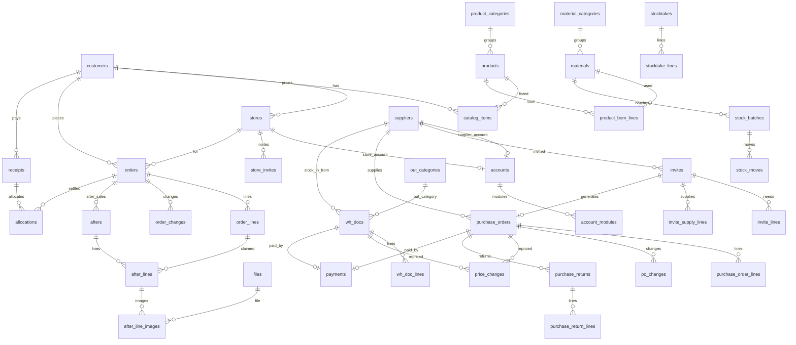

# 04 数据模型

整理日期：2026-09-30。数据库 PostgreSQL，表定义用 Drizzle（`server/db/schema`，一张表一个 `pgTable`），迁移由 Drizzle Kit 生成。枚举和字段规则（手机号格式、金额非负、数量为正等）只在 `shared` 定义，表结构的 `pgEnum`、`CHECK` 和 `shared/contract` 的请求、响应结构都引用它（05 第 1.1 节）。

依据：冻结原型 `huazhong-unified`（提交 5dd7d7c）各模块的真实字段；业务规则见 03 章，本文不复述。不参考老小程序代码。本文只写字段、约束和算法，不写完整代码。

## 1. 公共约定

| 项 | 规则 |
|---|---|
| 表名 | snake_case 复数，例如 `purchase_orders`；接口字段格式见 00 章第 3 节 |
| 主键 | `id BIGINT GENERATED ALWAYS AS IDENTITY`（Drizzle：`bigint('id',{mode:'number'}).primaryKey().generatedAlwaysAsIdentity()`）。接口用 `id` 取数，界面显示 `no`；接口格式见 00 章第 3 节 |
| 单号 `no` | `TEXT NOT NULL UNIQUE`，格式见 `shared/config` 的 `DOC_NO_FORMAT`（例如 `SO-260930-001`）；按 `Asia/Shanghai` 日期由 `doc_sequences` 发号，超过 999 自然变 4 位 |
| 乐观锁 | 会被修改的单据有 `version INTEGER NOT NULL DEFAULT 1`，每次写 +1；更新带 `WHERE id=? AND version=?`，影响 0 行返回 `STALE` |
| 时间 | `created_at`、`updated_at TIMESTAMPTZ(3) NOT NULL DEFAULT now()`；业务日期（下单、出货、入库、收付款日期）用 `DATE`；「今天」按 `Asia/Shanghai` 算 |
| 操作人 | `created_by BIGINT NOT NULL → accounts.id`；各动作另有 `*_by`、`*_at`（例如 `shipped_by`、`shipped_at`） |
| 金额 | 整数「分」，列名 `*_cents INTEGER`，每列有 `CHECK`；合计在查询里按 `BIGINT` 求和 |
| 数量 | `INTEGER` + `CHECK`（原型所有数量都是整数） |
| 名称快照 | 单据明细存 `name`、`unit` 快照（原型就是这样），主数据改名、改单位不影响历史单据 |
| 主数据 | 只停用不删除（`enabled BOOLEAN NOT NULL DEFAULT true`）；外键一律 `ON DELETE RESTRICT` |
| 状态 | PostgreSQL 原生 enum（Drizzle `pgEnum`）存英文码；英文码和中文名只在 `shared` 包定义，`pgEnum` 直接取 `shared` 的枚举值，见第 2 节 |
| 例外 | 复合主键的支撑表（`account_modules`、`doc_sequences`、`idempotency_keys`）只有各自列出的字段；只插入的表（`operation_logs`、`stock_moves`）没有 `updated_at` |
| JSONB | 只用在改单记录、改价记录的 `items`，盘点单的分类快照，日志的 `before`、`after`；其余都是独立表 |
| 算出来的值 | 应收、已收、未收、预收、收款状态、应付、付款状态、库存、在途、可申请售后数量，以及单据的 `actions`、`lockedReason` 都不存，按第 8 节查询时算 |
| 业务参数 | 上限、有效期、分页、编码前缀等只引用 `shared/config` 的配置名（05 第 1.6 节），本文不写数字 |

下文每张表都含公共列：`id`、`created_at`、`updated_at`、`created_by`；标「有版本」的另含 `version`。表格里不再重复。

单号前缀：

| 前缀 | 单据 | 前缀 | 单据 |
|---|---|---|---|
| SO | 订单 | RK | 手工入库单 |
| AS | 售后 | CK | 手工出库单 |
| PO | 采购单 | BS | 报损单 |
| YQ | 填报邀请 | PD | 盘点单 |
| SK | 收款 | FK | 付款 |

核销、退货、库存批次、出入库流水没有单号，只用 `id`。

## 2. 枚举码与中文名

中文名以 03 章第 3 节为准。前端只显示中文名，接口传英文码。

| enum | 英文码 → 中文 |
|---|---|
| `order_status` | `pending_confirm` 待确认、`to_ship` 待发货、`shipped` 已发货、`cancelled` 已取消 |
| `order_origin` | `store` 门店下单、`sales` 销售新建 |
| `store_invite_status` | `pending` 待使用、`used` 已使用、`expired` 已过期、`voided` 已作废 |
| `after_status` | `pending` 待处理、`processed` 已处理、`closed` 已关闭、`voided` 已作废 |
| `after_origin` | `store` 门店提交、`sales` 销售新建 |
| `after_reason` | `damaged` 花材损坏、`qty_mismatch` 数量不符、`quality` 品质问题、`other` 其他 |
| `record_status`（收款、付款共用） | `valid` 有效、`voided` 已作废 |
| `alloc_kind` | `receipt` 收款、`prepaid` 预收核销 |
| `invite_status` | `pending` 待填报、`submitted` 已提交、`cancelled` 已取消 |
| `po_status` | `to_receive` 待收货、`received` 已收货、`rejected` 已拒收、`cancelled` 已取消 |
| `wh_doc_kind` | `in` 手工入库、`out` 手工出库、`loss` 报损 |
| `wh_doc_status` | `stocked_in` 已入库、`stocked_out` 已出库、`lost` 已报损、`voided` 已作废 |
| `stocktake_status` | `done` 已盘点 |
| `move_type` | `po_in` 采购入库、`po_return` 采购退货、`manual_in` 手工入库、`in_void` 入库作废、`manual_out` 手工出库、`loss` 报损、`check_gain` 盘点盘盈、`check_loss` 盘点盘亏 |
| `account_type` | `admin` 管理员、`staff` 员工、`store` 门店、`supplier` 供应商 |
| `module_key` | `sales` 销售、`shipping` 发货、`purchase` 采购、`warehouse` 仓库、`finance` 财务 |
| `method_kind` | `receive` 收款方式、`pay` 付款方式 |
| `file_status` | `pending` 待检测、`ok` 通过、`rejected` 不通过 |

算出来、不存库的状态（接口里以英文码返回，中文名同样在 `shared`）：

| 名称 | 英文码 → 中文 | 算法见 |
|---|---|---|
| 发货单收款状态（接口字段 `payStatus`） | `unpaid` 未收、`partial` 部分收、`paid` 已收（门店端显示未付、部分付、已付） | 第 8 节 |
| 售后抵扣标记 | `offsetByAfter` 布尔：应收 0 且售后 > 0 | 第 8 节 |
| 付款状态（接口字段 `apStatus`） | `to_pay` 待付款、`paid` 已付款、`no_pay` 无需付款 | 第 8 节 |
| 采购需求 | `invited` 已邀请（缺货 / 够用由 `leftQty` 正负得出，不另返回） | 第 8 节 |
| 采购单标记 | `changed` 改单、`repriced` 改价、`all_returned` 已全部退货 | 有记录即为真 |
| 订单标记 | `changed` 改单、`repriced`（明细单价 ≠ 目录价） | 同上 |
| 订货目录 | `off` 停订（`catalog_items.enabled=false`） | — |

状态标签颜色见 02 章，和中文名一起放在 `shared` 的状态表里。

## 3. 账号与公共

### 3.1 `accounts` 账号（有版本）

员工、管理员、门店账号、供应商端账号都在这一张表。供应商端账号只存这一份（原型在采购供应商资料和公共用户表各存一份）。

| 字段 | 类型与约束 | 说明 | 原型字段 |
|---|---|---|---|
| type | `account_type NOT NULL` | 管理员、员工、门店、供应商 | `admin`、`type` |
| name | `TEXT NOT NULL` | 姓名 | `name` |
| phone | `TEXT NOT NULL CHECK (phone ~ '^1[0-9]{10}$')` | 登录手机号。员工、门店、供应商账号都必填，由管理员、销售（门店资料）、采购（供应商资料）预先录入；启用账号里唯一 | `phone`、`loginPhone` |
| openid | `TEXT NULL` | 首次手机号快速验证后绑定；退出登录（= 解绑）或销售、管理员解绑时清空，下次重新手机号验证。门店账号已绑定微信时，新邀请不能再绑 | 无 |
| store_id | `BIGINT NULL → stores.id` | 门店账号必填 | `store` |
| supplier_id | `BIGINT NULL → suppliers.id` | 供应商账号必填 | `supplier` |
| enabled | `BOOLEAN NOT NULL DEFAULT true` | 停用后不能登录。门店账号还要看 `stores.enabled`，供应商账号还要看 `suppliers.enabled`：门店或供应商停用，关联账号同样不能登录（守卫每次请求都查） | `enabled` |
| bound_at | `TIMESTAMPTZ(3) NULL` | 绑定微信时间 | 无 |

约束：`CHECK ((type='store') = (store_id IS NOT NULL))`、`CHECK ((type='supplier') = (supplier_id IS NOT NULL))`。

第一个管理员没有人创建它：插入时先从 `accounts_id_seq` 取号，`id` 和 `created_by` 都写这个号（`OVERRIDING SYSTEM VALUE`），其余账号的 `created_by` 是真实的操作人。

索引：部分唯一 `(phone) WHERE enabled`；部分唯一 `(openid) WHERE openid IS NOT NULL`；部分唯一 `(store_id) WHERE type='store' AND enabled`（一店一账号）；部分唯一 `(supplier_id) WHERE type='supplier' AND enabled`（一家一个供应商端账号）。

门店账号显示的组织名「客户 · 门店」、供应商账号的组织名都从关联表取，不另存（原型的 `org`）。

### 3.2 `account_modules` 员工模块

| 字段 | 类型与约束 | 说明 | 原型字段 |
|---|---|---|---|
| account_id | `BIGINT NOT NULL → accounts.id` | 只允许 `type='staff'`（服务层校验） | `modules[]` |
| module | `module_key NOT NULL` | | |

主键 `(account_id, module)`。管理员不写这张表，默认全部模块。多模块员工权限取并集。

### 3.3 `operation_logs` 操作日志

只插入，不更新、不删除。在业务事务里一起写。

| 字段 | 类型与约束 | 说明 | 原型字段 |
|---|---|---|---|
| module | `module_key NULL` | 门店端的操作记在 `sales`，供应商端的记在 `purchase`（原型如此）；账号类操作（绑定、解绑微信，新增、修改员工）为 `NULL`，界面叫「公共」，只有管理员能看（03 章第 8.5 节） | `module` |
| kind | `TEXT NOT NULL` | 对象类别，例如「订单」「售后」「采购到货」 | `kind` |
| action | `TEXT NOT NULL` | 例如「确认订单」「作废售后」 | `action` |
| target_type | `TEXT NOT NULL` | 表名，例如 `orders` | 无 |
| target_id | `BIGINT NULL` | | 无 |
| target_label | `TEXT NOT NULL` | 单号或对象名，用于列表显示 | `target` |
| actor_label | `TEXT NOT NULL` | 快照：员工是姓名，外部账号是「姓名（组织）」，自动动作是「系统」 | `actor` |
| reason | `TEXT NOT NULL DEFAULT ''` | | `reason` |
| before | `JSONB NULL` | 修改前的业务视图（中文名、元为单位都可以，只用于展示） | `before` |
| after | `JSONB NULL` | 修改后 | `after` |

`created_by` 在自动动作时可空。索引：`(module, created_at DESC)`、`(target_type, target_id)`。

### 3.4 其他公共表

| 表 | 字段 | 约束和说明 |
|---|---|---|
| `doc_sequences` | `prefix TEXT`、`day DATE`、`last INTEGER NOT NULL` | 主键 `(prefix, day)`。发号：`INSERT … VALUES (?, ?, 1) ON CONFLICT (prefix, day) DO UPDATE SET last = doc_sequences.last + 1 RETURNING last`，和业务写入在同一事务里 |
| `idempotency_keys` | `account_id`、`key TEXT`、`endpoint TEXT`、`response JSONB NULL`、`created_at` | 主键 `(account_id, key)`。事务一开始先插入这一行占住键（并发的同一键会等前一个事务结束），业务写完在同一事务里填 `response`；同一键重复提交直接返回上次结果，换了接口返回 `VALIDATION_FAILED`；保留 `IDEMPOTENCY_TTL_HOURS`（`shared/config`），pg-boss 每天清理 |
| `files` | `purpose TEXT`（after_image / product_image）、`cos_key TEXT UNIQUE`、`thumb_key TEXT NULL`、`size_bytes INTEGER CHECK (size_bytes > 0)`、`mime TEXT`、`status file_status`、`uploaded_by` | 上传完成登记；内容安全检测结果写 `status`，业务表只能引用 `status='ok'` 的文件 |

## 4. 销售、门店端、发货

### 4.1 主数据

| 表 | 字段（类型与约束） | 说明 | 原型字段 |
|---|---|---|---|
| `customers` | `name TEXT NOT NULL UNIQUE`、`enabled` | 客户（往来单位），对账按客户。停用规则见 03 章第 5 节 | `customers[]`（原型没有 enabled，新加） |
| `stores` | `customer_id → customers.id NOT NULL`、`name TEXT NOT NULL`、`contact TEXT`、`phone TEXT`、`address TEXT`、`enabled` | 唯一 `(customer_id, name)`。停用规则见 03 章第 2、5 节 | `stores[]` |
| `product_categories` | `name TEXT NOT NULL UNIQUE`、`sort INTEGER NOT NULL DEFAULT 0` | 产品分类（门店订货左侧分类） | `cats[]` |
| `products` | `name TEXT NOT NULL`、`category_id → product_categories.id`、`unit TEXT NOT NULL`、`image_file_id → files.id NULL`、`enabled` | 成品。停用规则见 03 章第 5 节；原型没有产品级启用，新加 | `products[]` |
| `product_bom_lines` | `product_id → products.id`、`material_id → materials.id`、`qty INTEGER NOT NULL CHECK (qty > 0)` | 配方，唯一 `(product_id, material_id)`。直接关联花材，原型的「配方对不上花材资料」在新版不会出现 | `bom[]` |
| `catalog_items` | `customer_id → customers.id`、`product_id → products.id`、`price_cents INTEGER NOT NULL CHECK (price_cents >= 0)`、`enabled`、有版本 | 订货目录：每个客户一份价目。唯一 `(customer_id, product_id)`。`enabled=false` 即停订 | `directory[客户][]` |

### 4.2 `orders` 订单（有版本）

| 字段 | 类型与约束 | 说明 | 原型字段 |
|---|---|---|---|
| no | `TEXT NOT NULL UNIQUE` | SO-… | `id` |
| order_date | `DATE NOT NULL` | 下单日期；门店改单不变 | `date` |
| ship_date | `DATE NOT NULL` | 出货日期；门店端不能早于今天，销售可以，服务层校验 | `ship` |
| customer_id | `→ customers.id NOT NULL` | | `customer` |
| store_id | `→ stores.id NOT NULL` | 必须属于 customer_id（服务层校验） | `store` |
| status | `order_status NOT NULL` | | `status` |
| origin | `order_origin NOT NULL` | | `origin` |
| note | `TEXT NOT NULL DEFAULT ''` | 门店或销售写的备注 | `note` |
| confirmed_by / confirmed_at | `NULL` | 销售确认（含修改并确认） | 无 |
| shipped_by / shipped_at | `NULL` | 确认发货 | `shipper`、`shippedAt` |
| ship_note | `TEXT NOT NULL DEFAULT ''` | 少发时必填（服务层校验） | `shipNote` |
| cancelled_by / cancelled_at | `NULL` | | 无 |
| cancel_reason | `TEXT NULL` | 取消原因；待确认取消时为空 | `closeReason` |

约束：`CHECK (status <> 'shipped' OR shipped_at IS NOT NULL)`。索引：`(status, ship_date)`、`(store_id, order_date DESC)`、`(customer_id, status)`。

状态流转：门店下单 → `pending_confirm`；销售新建 → `to_ship`；`pending_confirm` → `to_ship`（确认、修改并确认）；`to_ship` → `shipped`（确认发货）；`pending_confirm`、`to_ship` → `cancelled`。

### 4.3 `order_lines` 订单明细

| 字段 | 类型与约束 | 说明 | 原型字段 |
|---|---|---|---|
| order_id | `→ orders.id NOT NULL ON DELETE CASCADE` | 改单时整组替换 | |
| product_id | `→ products.id NOT NULL` | 唯一 `(order_id, product_id)` | `product` |
| name / unit | `TEXT NOT NULL` | 快照 | `name`、`unit` |
| qty | `INTEGER NOT NULL CHECK (qty > 0)` | 订货数量 | `qty` |
| price_cents | `INTEGER NOT NULL CHECK (price_cents >= 0)` | 下单单价，可改（改过的标「改价」） | `price` |
| list_price_cents | `INTEGER NOT NULL CHECK (list_price_cents >= 0)` | 下单时的目录价快照 | `listPrice` |
| shipped_qty | `INTEGER NULL CHECK (shipped_qty >= 0 AND shipped_qty <= qty)` | 实发；确认发货时写，之后不能改 | `shipped` |
| sort | `INTEGER NOT NULL` | 显示顺序 | 数组下标 |

### 4.4 `order_changes` 订单变更记录

| 字段 | 类型与约束 | 说明 | 原型字段 |
|---|---|---|---|
| order_id | `→ orders.id NOT NULL` | | |
| actor_label | `TEXT NOT NULL` | 快照 | `changes[].actor` |
| reason | `TEXT NOT NULL DEFAULT ''` | 门店改单为空；销售改单、修改并确认必填 | `changes[].reason` |
| items | `JSONB NOT NULL` | 字符串数组，例如 `["粉玫瑰日常花束 数量 15 → 18","出货日期 2026-09-29 → 2026-09-30"]`；内容没变不写记录 | `changes[].items` |

索引 `(order_id, created_at)`。有记录即卡片标「改单」。

### 4.5 `afters` 售后（有版本）

| 字段 | 类型与约束 | 说明 | 原型字段 |
|---|---|---|---|
| no | `TEXT NOT NULL UNIQUE` | AS-… | `id` |
| after_date | `DATE NOT NULL` | 提交日期 | `date` |
| order_id | `→ orders.id NOT NULL` | 必须是已发货订单（服务层校验） | `order` |
| customer_id / store_id | `NOT NULL` | 冗余自订单，便于按门店、客户查 | `customer`、`store` |
| status | `after_status NOT NULL` | | `status` |
| origin | `after_origin NOT NULL` | 门店提交 → `pending`；销售新建直接 `processed` | `origin` |
| amount_cents | `INTEGER NULL CHECK (amount_cents >= 0)` | 处理后写入 = Σ 行金额；待处理为空 | `amount` |
| note | `TEXT NOT NULL DEFAULT ''` | 处理说明，选填 | `note` |
| processed_by / processed_at | `NULL` | | 无 |
| close_reason | `TEXT NULL` | 关闭原因（必填） | `closeReason` |
| void_reason / voided_by / voided_at | `NULL` | 作废（必填原因） | `voidReason`、`voidAt` |

约束：`CHECK (status <> 'processed' OR amount_cents IS NOT NULL)`、`CHECK (status <> 'voided' OR void_reason IS NOT NULL)`。索引：`(order_id, status)`、`(store_id, after_date DESC)`、`(status, after_date DESC)`。

状态流转：`pending` → `processed` / `closed`；`processed` → `voided`。

### 4.6 `after_lines` 售后明细

| 字段 | 类型与约束 | 说明 | 原型字段 |
|---|---|---|---|
| after_id | `→ afters.id NOT NULL ON DELETE CASCADE` | | |
| order_line_id | `→ order_lines.id NOT NULL` | 挂在原发货单的这一行；唯一 `(after_id, order_line_id)` | `product` |
| name / unit | `TEXT NOT NULL` | 快照 | `name`、`unit` |
| requested_qty | `INTEGER NULL CHECK (requested_qty > 0)` | 门店原始申请数量：门店提交时写入，处理时不覆盖；销售新建的售后为空 | 无（原型处理时覆盖 `qty`） |
| qty | `INTEGER NOT NULL CHECK (qty >= 0)` | 售后数量：门店提交时 = `requested_qty`；销售处理门店售后时改这一列，可以填 0，服务层校验至少一行 > 0 | `qty` |
| price_cents | `INTEGER NOT NULL CHECK (price_cents >= 0)` | 默认发货单价，只能改低（服务层对 `order_lines.price_cents` 校验） | `price` |
| reason | `after_reason NOT NULL` | 门店提交的售后只读 | `reason` |
| description | `TEXT NOT NULL DEFAULT ''` | 问题说明；门店提交时必填 | `description` |
| sort | `INTEGER NOT NULL` | | 下标 |

行金额 = `qty × price_cents`，整数不需要四舍五入。原型的 `max`（可申请数量）不存，按第 8 节现算。

### 4.7 `after_line_images` 售后图片

| 字段 | 类型与约束 | 说明 | 原型字段 |
|---|---|---|---|
| after_line_id | `→ after_lines.id NOT NULL ON DELETE CASCADE` | | |
| file_id | `→ files.id NOT NULL` | 只能引用 `purpose='after_image' AND status='ok'` | `images[]` |
| sort | `SMALLINT NOT NULL` | | |

唯一 `(after_line_id, file_id)`；每行最多 `AFTER_IMAGE_MAX_COUNT` 张（服务层校验，单张 ≤ `IMAGE_MAX_BYTES` 在签名时限制，配置在 `shared/config`）。

### 4.8 `store_invites` 门店邀请下单

销售给门店生成分享邀请，门店打开后用手机号快速验证绑定门店账号。同一门店同一时间只有一条有效邀请；门店账号已绑定微信时不能再用邀请绑定，要销售或管理员先在门店资料里解绑。

| 字段 | 类型与约束 | 说明 | 原型字段 |
|---|---|---|---|
| store_id | `→ stores.id NOT NULL` | 邀请哪家门店 | 无 |
| token_hash | `TEXT NOT NULL UNIQUE` | 分享路径里带随机 token（`STORE_INVITE_TOKEN_BYTES` 字节），库里只存 SHA-256 | 无 |
| expires_at | `TIMESTAMPTZ(3) NOT NULL` | 生成时间 + `STORE_INVITE_TTL_DAYS` 天 | 无 |
| status | `store_invite_status NOT NULL DEFAULT 'pending'` | 绑定成功 → `used`；过期 → `expired`；同一门店重新生成邀请时，旧的待使用邀请改成 `voided`（使用时按 `expires_at` 判断，pg-boss 每天把过期的改成 `expired`） | 无 |
| bound_account_id | `→ accounts.id NULL` | 绑定的门店账号 | 无 |
| bound_at | `TIMESTAMPTZ(3) NULL` | 绑定时间 | 无 |

约束：`CHECK ((status='used') = (bound_at IS NOT NULL))`。索引：`(store_id, created_at DESC)`；部分唯一 `(store_id) WHERE status='pending'`（同一门店只有一条待使用）。

状态流转：`pending` → `used`（手机号和门店账号登录手机号一致，绑定成功）/ `expired` / `voided`（重新生成邀请时自动作废）。用过、过期、作废都失效。

## 5. 采购、供应商端

### 5.1 `suppliers` 供应商（有版本）

| 字段 | 类型与约束 | 说明 | 原型字段 |
|---|---|---|---|
| name | `TEXT NOT NULL UNIQUE` | 必填不重复 | `name` |
| contact / phone / address | `TEXT NOT NULL DEFAULT ''` | | `contact`、`phone`、`address` |
| enabled | `BOOLEAN NOT NULL DEFAULT true` | 停用后已下的单照常收货付款；待填报邀请自动取消 | `enabled` |

供应商端账号在 `accounts`（`type='supplier'`），是否开通 = 有一条启用的供应商账号（原型的 `account`、`loginPhone`）。

### 5.2 `purchase_orders` 采购单（有版本）

| 字段 | 类型与约束 | 说明 | 原型字段 |
|---|---|---|---|
| no | `TEXT NOT NULL UNIQUE` | PO-… | `id` |
| order_date | `DATE NOT NULL` | 下单日期 | `date` |
| supplier_id | `→ suppliers.id NOT NULL` | 填报生成的单不能改（服务层校验） | `supplier` |
| buyer_id | `→ accounts.id NOT NULL` | 采购员；填报生成的单是发邀请的人 | `buyer` |
| invite_id | `→ invites.id NULL UNIQUE` | 由填报生成时有值 | `invite` |
| status | `po_status NOT NULL` | | `status` |
| note | `TEXT NOT NULL DEFAULT ''` | | `note` |
| received_by / received_at | `NULL` | 确认收货或拒收 | `receiver`、`receivedAt` |
| recv_note | `TEXT NOT NULL DEFAULT ''` | | `recvNote` |
| cancel_reason / cancelled_by / cancelled_at | `NULL` | 取消原因必填 | `closeReason`、`cancelAt` |

原型的 `payable`、`repriced` 不存：应付按第 8 节算，改价看 `price_changes` 有没有记录。索引：`(status, order_date DESC)`、`(supplier_id, status)`。

状态流转：新建或填报提交 → `to_receive`；`to_receive` → `received`（实收有大于 0 的行）/ `rejected`（实收全 0）/ `cancelled`。

### 5.3 `purchase_order_lines` 采购明细

| 字段 | 类型与约束 | 说明 | 原型字段 |
|---|---|---|---|
| po_id | `→ purchase_orders.id NOT NULL ON DELETE CASCADE` | 收货前改单时整组替换 | |
| material_id | `→ materials.id NOT NULL` | 唯一 `(po_id, material_id)` | `material` |
| name / unit | `TEXT NOT NULL` | 快照 | `name`、`unit` |
| qty | `INTEGER NOT NULL CHECK (qty > 0)` | 采购数量 | `qty` |
| order_price_cents | `INTEGER NOT NULL CHECK (order_price_cents >= 0)` | 下单单价；0 = 赠送 | `orderPrice` |
| price_cents | `INTEGER NOT NULL CHECK (price_cents >= 0)` | 当前单价（仓库改价后变） | `price` |
| received_qty | `INTEGER NULL CHECK (received_qty >= 0)` | 实收，可多可少 | `received` |
| returned_qty | `INTEGER NOT NULL DEFAULT 0 CHECK (returned_qty >= 0)` | 累计退货，和 `purchase_returns` 在同一事务里更新；`CHECK (returned_qty <= COALESCE(received_qty,0))` | `returned` |
| sort | `INTEGER NOT NULL` | | 下标 |

### 5.4 改单、改价、退货记录

| 表 | 字段 | 说明 | 原型字段 |
|---|---|---|---|
| `po_changes` | `po_id NOT NULL`、`actor_label`、`reason TEXT NOT NULL`、`items JSONB NOT NULL`（字符串数组，含换供应商） | 采购改单记录，三端可见，有记录即标「改单」 | `changes[]` |
| `price_changes` | `po_id NULL`、`wh_doc_id NULL`、`actor_label`、`reason TEXT NOT NULL`、`items JSONB NOT NULL`（`[{name, fromCents, toCents}]`） | 采购单和手工入库单共用；`CHECK (num_nonnulls(po_id, wh_doc_id) = 1)`；收货时改价、收货后改价都写这里 | `priceChanges[]` |
| `purchase_returns` | `po_id NOT NULL`、`actor_label` | 一次退货一条，不用原因 | `returns[]` |
| `purchase_return_lines` | `return_id NOT NULL ON DELETE CASCADE`、`po_line_id NOT NULL`、`name`、`qty INTEGER CHECK (qty > 0)` | 每种花材累计不超过实收、库存（服务层校验） | `returns[].items[]` |

### 5.5 `invites` 填报邀请（有版本）

| 字段 | 类型与约束 | 说明 | 原型字段 |
|---|---|---|---|
| no | `TEXT NOT NULL UNIQUE` | YQ-… | `id` |
| invite_date | `DATE NOT NULL` | | `date` |
| supplier_id | `→ suppliers.id NOT NULL` | 必须有启用的供应商端账号（服务层校验） | `supplier` |
| buyer_id | `→ accounts.id NOT NULL` | | `buyer` |
| status | `invite_status NOT NULL` | | `status` |
| submitted_at | `NULL` | | `submittedAt` |
| cancelled_by / cancelled_at | `NULL` | 自动取消时 `cancelled_by` 为空 | `cancelAt` |
| cancel_note | `TEXT NULL` | 自动取消写「停用供应商，自动取消」「关闭供应商端账号，自动取消」 | `cancelNote` |

生成的采购单由 `purchase_orders.invite_id` 反查。索引：`(status, supplier_id)`。

填报分享链接不另存表：路径带邀请号和 HMAC 签名（只签邀请 ID），不设有效期；邀请不是 `pending`（已提交、已取消）就失效，只有这家供应商的账号能打开。

状态流转：`pending` → `submitted`（供应商提交，同一事务生成采购单）/ `cancelled`（采购取消，或停用供应商、关闭账号时自动取消）。

| 表 | 字段 | 说明 | 原型字段 |
|---|---|---|---|
| `invite_lines` | `invite_id NOT NULL ON DELETE CASCADE`、`material_id`、`name`、`unit`、`need_qty INTEGER CHECK (need_qty > 0)`、`sort` | 需求花材，唯一 `(invite_id, material_id)`；待填报时可整组替换 | `lines[].need` |
| `invite_supply_lines` | `invite_id NOT NULL`、`material_id`、`name`、`unit`、`qty INTEGER CHECK (qty > 0)`、`price_cents INTEGER CHECK (price_cents >= 0)`、`sort` | 供应商提交时的供货快照（可另报花材），之后采购单改单不影响它 | `supply[]` |

## 6. 仓库

### 6.1 主数据

| 表 | 字段（类型与约束） | 说明 | 原型字段 |
|---|---|---|---|
| `material_categories` | `name TEXT NOT NULL UNIQUE`、`sort INTEGER NOT NULL DEFAULT 0` | 花材分类，可新增、改名（改名只改这一行，花材跟着变） | `cats[]` |
| `materials` | `code TEXT NOT NULL UNIQUE`、`name TEXT NOT NULL`、`category_id → material_categories.id NOT NULL`、`unit TEXT NOT NULL`、`enabled`、有版本 | 名称可以重复，编码不能重复；新建默认 `MATERIAL_CODE_PREFIX` + 现有最大数字 + 1，可改。改单位不换算已有数量，只记日志 | `materials[]` |
| `out_categories` | `name TEXT NOT NULL UNIQUE`、`enabled`、`sort` | 出库分类；至少保留一个启用的（服务层校验）。初始：生产领用、门店零售、样品、其他 | `outCats[]` |

停用花材的规则见 03 章第 8.3 节。

### 6.2 `stock_batches` 库存批次

每次入库（采购收货、手工入库、盘点盘盈）生成一个批次。

| 字段 | 类型与约束 | 说明 | 原型字段 |
|---|---|---|---|
| material_id | `→ materials.id NOT NULL` | | `material` |
| in_date | `DATE NOT NULL` | 入库日期，先进先出按 `(in_date, id)` | `date` |
| source_type | `TEXT NOT NULL` | `purchase_orders` / `wh_docs` / `stocktakes` | 无 |
| source_id | `BIGINT NOT NULL` | 来源单据；采购退货、入库作废先扣这张单的批次 | 无 |
| qty | `INTEGER NOT NULL CHECK (qty > 0)` | 入库数量 | `qty` |
| left_qty | `INTEGER NOT NULL CHECK (left_qty >= 0 AND left_qty <= qty)` | 剩余，扣减时 `SELECT … FOR UPDATE` 后更新 | `left` |

索引：`(material_id, in_date, id) WHERE left_qty > 0`（部分索引，只扫有剩余的批次）、`(source_type, source_id)`。

批次在界面上只在出入库记录里显示为「MM-DD 入库」，不需要单号。

### 6.3 `stock_moves` 出入库流水

只插入。一次扣减跨多个批次就写多条。

| 字段 | 类型与约束 | 说明 | 原型字段 |
|---|---|---|---|
| moved_at | `TIMESTAMPTZ(3) NOT NULL` | | `time` |
| type | `move_type NOT NULL` | | `type` |
| material_id | `→ materials.id NOT NULL` | | `material` |
| batch_id | `→ stock_batches.id NOT NULL` | | `batch` |
| qty | `INTEGER NOT NULL CHECK (qty <> 0)` | 正数入库、负数出库 | `qty` |
| doc_type / doc_id | `TEXT NOT NULL`、`BIGINT NOT NULL` | 来源单据，用于点开单据 | `doc` |
| doc_no | `TEXT NOT NULL` | 单号快照，列表直接显示 | `doc` |
| reason | `TEXT NOT NULL DEFAULT ''` | | `reason` |

`CHECK ((type IN ('po_in','manual_in','check_gain')) = (qty > 0))`。索引：`(material_id, moved_at DESC)`、`(type, moved_at DESC)`、`(doc_type, doc_id)`。

库存 = `SUM(stock_batches.left_qty)`，也等于 `SUM(stock_moves.qty)`；两者不一致说明有 bug，接口测试里要核对。

### 6.4 `wh_docs` 手工入库、手工出库、报损（有版本）

| 字段 | 类型与约束 | 说明 | 原型字段 |
|---|---|---|---|
| no | `TEXT NOT NULL UNIQUE` | RK / CK / BS | `id` |
| kind | `wh_doc_kind NOT NULL` | | `kind` |
| doc_date | `DATE NOT NULL` | | `date` |
| status | `wh_doc_status NOT NULL` | | `status` |
| supplier_id | `→ suppliers.id NULL` | 手工入库必填（启用的供应商） | `supplier` |
| out_category_id | `→ out_categories.id NULL` | 手工出库必填 | `outCat` |
| reason | `TEXT NOT NULL DEFAULT ''` | 报损必填；入库、出库选填 | `reason` |
| void_reason / voided_by / voided_at | `NULL` | 只有手工入库能作废 | `voidReason`、`voidAt` |

约束：`CHECK ((kind='in') = (supplier_id IS NOT NULL))`、`CHECK ((kind='out') = (out_category_id IS NOT NULL))`、`CHECK (kind <> 'loss' OR reason <> '')`、`CHECK ((kind='in' AND status IN ('stocked_in','voided')) OR (kind='out' AND status='stocked_out') OR (kind='loss' AND status='lost'))`、`CHECK (status <> 'voided' OR void_reason IS NOT NULL)`。

索引：`(kind, doc_date DESC)`、`(kind, out_category_id, doc_date DESC)`（手工出库列表按分类、出库日期筛选）、`(kind, supplier_id, status)`（手工入库列表）。手工出库、报损建好后只读。

手工入库的入库金额 = Σ 数量 × 单价，不存（原型的 `amount`）；改价标记看 `price_changes`。

| 表 | 字段 | 说明 | 原型字段 |
|---|---|---|---|
| `wh_doc_lines` | `doc_id NOT NULL ON DELETE CASCADE`、`material_id`、`name`、`unit`、`qty INTEGER CHECK (qty > 0)`、`price_cents INTEGER NULL CHECK (price_cents >= 0)`、`order_price_cents INTEGER NULL`、`sort` | 手工入库行必须有单价（0 = 赠送），出库、报损单价为空；唯一 `(doc_id, material_id)` | `lines[]` |

### 6.5 `stocktakes` 盘点单

| 字段 | 类型与约束 | 说明 | 原型字段 |
|---|---|---|---|
| no | `TEXT NOT NULL UNIQUE` | PD-… | `id` |
| check_date | `DATE NOT NULL` | | `date` |
| status | `stocktake_status NOT NULL DEFAULT 'done'` | 确认即完成，不能修改或作废 | `status` |
| categories | `JSONB NOT NULL` | 盘点时选的花材分类快照（名称数组），卡片标题显示 | `cats` |
| reason | `TEXT NOT NULL DEFAULT ''` | 有差异时必填（服务层校验） | `reason` |

| 表 | 字段 | 说明 | 原型字段 |
|---|---|---|---|
| `stocktake_lines` | `stocktake_id NOT NULL ON DELETE CASCADE`、`material_id`、`name`、`unit`、`book_qty INTEGER CHECK (book_qty >= 0)`、`actual_qty INTEGER CHECK (actual_qty >= 0)`、`diff_qty INTEGER GENERATED ALWAYS AS (actual_qty - book_qty) STORED` | 所选分类的全部花材（停用的也列）；`book_qty` 是打开盘点时的账面快照，确认时按当前库存复查，变了返回 `STALE`「库存已变化，已刷新账面数，请核对后再确认」（05 第 9 节）；有差异的行生成盘盈批次或按先进先出盘亏 | `lines[]` |

## 7. 财务

| 表 | 字段（类型与约束） | 说明 | 原型字段 |
|---|---|---|---|
| `payment_methods` | `kind method_kind NOT NULL`、`name TEXT NOT NULL`、`enabled`、`sort` | 收款方式、付款方式分两份；唯一 `(kind, name)`；每份至少一种启用（服务层校验） | `methods.receive/pay` |

### 7.1 `receipts` 收款（有版本）

| 字段 | 类型与约束 | 说明 | 原型字段 |
|---|---|---|---|
| no | `TEXT NOT NULL UNIQUE` | SK-… | `id` |
| receipt_date | `DATE NOT NULL` | | `date` |
| customer_id | `→ customers.id NOT NULL` | 按客户登记 | `customer` |
| amount_cents | `INTEGER NOT NULL CHECK (amount_cents > 0)` | | `amount` |
| method_name | `TEXT NOT NULL` | 快照；登记时必须是启用的收款方式 | `method` |
| note | `TEXT NOT NULL DEFAULT ''` | | `note` |
| status | `record_status NOT NULL DEFAULT 'valid'` | | `status` |
| void_reason / voided_by / voided_at | `NULL` | `CHECK (status <> 'voided' OR void_reason IS NOT NULL)` | `voidReason`、`voidAt` |

索引 `(customer_id, status)`、`(receipt_date DESC)`。

### 7.2 `allocations` 核销

| 字段 | 类型与约束 | 说明 | 原型字段 |
|---|---|---|---|
| receipt_id | `→ receipts.id NOT NULL` | | `receipt` |
| order_id | `→ orders.id NOT NULL` | 发货单（已发货订单） | `order` |
| amount_cents | `INTEGER NOT NULL CHECK (amount_cents > 0)` | 登记金额 | `amount` |
| kind | `alloc_kind NOT NULL` | 收款时核销 / 以后核销预收 | `kind` |
| revoked_at | `TIMESTAMPTZ(3) NULL` | 作废收款时，同一事务把这笔收款的核销全部写上 | 无（原型靠收款状态过滤） |

索引：`(order_id) WHERE revoked_at IS NULL`、`(receipt_id) WHERE revoked_at IS NULL`。同一收款、同一发货单可以有多条（收款时核销一次，以后核销预收再来一次），不做唯一约束。

「登记金额」和「实际生效金额」不同：售后后来冲减应收时，核销按第 8 节重算，超出的部分回到这笔收款的预收。

### 7.3 `payments` 付款（有版本）

| 字段 | 类型与约束 | 说明 | 原型字段 |
|---|---|---|---|
| no | `TEXT NOT NULL UNIQUE` | FK-… | `id` |
| pay_date | `DATE NOT NULL` | | `date` |
| supplier_id | `→ suppliers.id NOT NULL` | | `supplier` |
| po_id | `→ purchase_orders.id NULL` | | `po`（PO- 开头） |
| wh_doc_id | `→ wh_docs.id NULL` | 只能是手工入库单 | `po`（RK- 开头） |
| amount_cents | `INTEGER NOT NULL CHECK (amount_cents > 0)` | 一次付清，= 确认时的应付 | `amount` |
| method_name / note | `TEXT` | 快照 | `method`、`note` |
| status | `record_status NOT NULL DEFAULT 'valid'` | | `status` |
| void_reason / voided_by / voided_at | `NULL` | | `voidReason`、`voidAt` |

约束：`CHECK (num_nonnulls(po_id, wh_doc_id) = 1)`。部分唯一：`(po_id) WHERE status='valid'`、`(wh_doc_id) WHERE status='valid'`（一张单只能有一笔有效付款）。

「付过款」= 这张单在 `payments` 里有任何一条记录（含已作废）；它带来的限制见 03 章第 5 节。

## 8. 查询时算的值

算法（名称和公式）见 03 章第 4 节，本节不复述，只写每个值取哪些表和字段，以及 03 没写的实现要点。都由后端 service 算好返回，前端不算；同一个值只写一个函数，各模块调用它；对账、采购需求这类统计可以直接写 SQL。

| 值（接口字段） | 用到的表和字段 | 实现要点 |
|---|---|---|
| 订单金额、发货金额（`amountCents`） | `order_lines.qty`、`shipped_qty`、`price_cents` | 发货前按 `qty`，已发货按 `shipped_qty` |
| 售后金额（`afterCents`）、应收 | `afters.amount_cents`（`status='processed'`） | 应收不小于 0 |
| 已收、未收（`unpaidCents`）、预收（`prepaidCents`）、`payStatus`、`offsetByAfter` | `allocations`（`revoked_at IS NULL`）、`receipts`（`status='valid'`、`amount_cents`） | 按客户取核销，按 `created_at` 升序逐条算生效金额 = min(登记金额, 发货单剩余应收, 这笔收款剩余)，≤ 0 跳过。`payStatus`：未收 ≤ 0 为 `paid`，已收 > 0 为 `partial`，否则 `unpaid`；`offsetByAfter` = 应收 0 且售后 > 0。作废售后、作废收款后不改核销表，重算即可 |
| 可申请售后数量（`maxQty`） | `order_lines.shipped_qty`、`after_lines.qty`（所属售后 `status IN ('pending','processed')`） | 处理某张售后时排除这张本身 |
| 应付（`payableCents`）、`apStatus`、`allReturned` | `purchase_order_lines.received_qty`、`returned_qty`、`price_cents`；`wh_doc_lines.qty`、`price_cents`；`payments`（`status='valid'`） | 采购单只算 `received`；手工入库单 `voided` 为 0。`apStatus`：有有效付款 `paid`，应付 0 `no_pay`，否则 `to_pay`。`allReturned`：已收货且每行 `returned_qty = received_qty` |
| 可退数量（`maxReturnQty`） | `received_qty − returned_qty`、这种花材的库存 | 取两者较小值 |
| 库存（`stockQty`、`bookQty`） | `stock_batches.left_qty` | 和流水的核对见 6.3 |
| 在途（`inTransitQty`）、需求（`needQty`）、余量（`leftQty`）、`invited` | `purchase_order_lines.qty`（采购单 `to_receive`）；`order_lines.qty × product_bom_lines.qty`（订单 `to_ship`、出货日期在区间内）；`invite_lines`（邀请 `pending`） | 按花材汇总，一条 SQL 算完 |

### 8.1 `actions` 和 `lockedReason`

- 不存库。每次返回详情或列表项（以及列表级 `actions`）时，service 按「账号角色 + 数据归属 + 单据当前状态」算出 `actions`（`[{ code, enabled, disabledReason, reasonRequired }]`，操作码见 05 第 1.5 节）和 `lockedReason`，文案在 `shared/copy`。
- `enabled: false` 和 `disabledReason`、`reasonRequired` 同样是查询时算的；明细行能否增删（`addLine`、`removeLine`）、能否换供应商（`changeSupplier`）也在这里算（看 `afters.origin`、`purchase_orders.invite_id`），不存布尔字段。
- 用到的判断（是否付过款、可申请数量、应付、门店是否启用）复用第 8 节表里的同一批函数，写接口的前置校验也调同一个函数，不另写一份。
- 列表查询一次算完整页的 `actions`，不在循环里逐条查库（例如一条 SQL 带出每张采购单是否付过款）。

## 9. ER 关系概览

`stock_batches.source_*`、`stock_moves.doc_*`、`operation_logs.target_*` 是多态引用（类型 + id），不建外键，由服务层保证。

表数量：42 张。账号与公共 6 张（含 `doc_sequences`、`idempotency_keys`、`files` 3 张支撑表），销售 13 张（含 `store_invites`），采购 10 张，仓库 9 张，财务 4 张。

## 10. 模型约束与技术表示

以下两条已写入当前模型和接口，属于现行实现约束；第 3 条是后续阶段需要统一的技术表示，不是新增业务决定：

1. 同一订单同一产品只允许一行明细（原型按产品去重），`order_lines`、`purchase_order_lines`、`wh_doc_lines` 都加了唯一约束。
2. 核销预收时多笔收款按收款时间先后扣（原型 `finSaveReceive`），本文照此写在 05 章，没有单独字段。
3. `stores` 的联系人、电话、地址写的是可空 `TEXT`，`suppliers` 的是 `NOT NULL DEFAULT ''`，两种写法要统一成一种。阶段 0 只建了这两张表的名称、归属、启用列，其余列在阶段 3、4 加的时候一起定。
