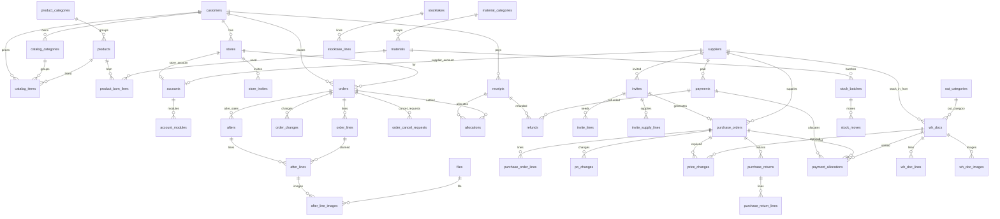

# 04 数据模型

整理日期：2026-09-30。数据库 PostgreSQL，表定义用 Drizzle（`server/db/schema`，一张表一个 `pgTable`），迁移由 Drizzle Kit 生成。枚举和字段规则（手机号格式、金额非负、数量为正等）只在 `shared` 定义，表结构的 `pgEnum`、`CHECK` 和 `shared/contract` 的请求、响应结构都引用它（05 第 1.1 节）。

依据：冻结原型 `huazhong-unified`（提交 5dd7d7c）各模块的真实字段；业务规则见 03 章，本文不复述。不参考老小程序代码。本文只写字段、约束和算法，不写完整代码。

## 1. 公共约定

| 项 | 规则 |
|---|---|
| 表名 | snake_case 复数，例如 `purchase_orders`；接口字段格式见 00 章第 3 节 |
| 主键 | `id BIGINT GENERATED ALWAYS AS IDENTITY`（Drizzle：`bigint('id',{mode:'number'}).primaryKey().generatedAlwaysAsIdentity()`）。接口用 `id` 取数，界面显示 `no`；接口格式见 00 章第 3 节 |
| 单号 `no` | `TEXT NOT NULL UNIQUE`，格式见 `shared/config` 的 `DOC_NO_FORMAT`（例如 `SO-260930-001`）；按 `Asia/Shanghai` 日期由 `doc_sequences` 发号，超过 999 自然变 4 位 |
| 乐观锁 | 会被修改的单据有 `version INTEGER NOT NULL DEFAULT 1`，每次写 +1；更新带 `WHERE id=? AND version=?`，影响 0 行返回 `STALE` |
| 时间 | `created_at`、`updated_at TIMESTAMPTZ(3) NOT NULL DEFAULT now()`；业务日期（下单、出货、入库、收付款日期）用 `DATE`；「今天」按 `Asia/Shanghai` 算 |
| 操作人 | `created_by BIGINT NOT NULL → accounts.id`；各动作另有 `*_by`、`*_at`（例如 `shipped_by`、`shipped_at`） |
| 金额 | 整数「分」，列名 `*_cents INTEGER`，每列有 `CHECK`；合计在查询里按 `BIGINT` 求和 |
| 数量 | `INTEGER` + `CHECK`（原型所有数量都是整数） |
| 名称快照 | 单据明细存 `name`、`unit` 快照（原型就是这样），主数据改名、改单位不影响历史单据 |
| 主数据 | 只停用不删除（`enabled BOOLEAN NOT NULL DEFAULT true`）；外键一律 `ON DELETE RESTRICT` |
| 状态 | PostgreSQL 原生 enum（Drizzle `pgEnum`）存英文码；英文码和中文名只在 `shared` 包定义，`pgEnum` 直接取 `shared` 的枚举值，见第 2 节 |
| 例外 | 复合主键的支撑表（`account_modules`、`doc_sequences`、`idempotency_keys`）只有各自列出的字段；只插入的表（`operation_logs`、`stock_moves`）没有 `updated_at` |
| JSONB | 只用在改单记录、改价记录的 `items`，盘点单的分类快照，日志的 `before`、`after`；其余都是独立表 |
| 算出来的值 | 应收、已收、未收、预收、收款状态、应付、付款状态、库存、在途、可申请售后数量，以及单据的 `actions`、`lockedReason` 都不存，按第 8 节查询时算 |
| 业务参数 | 上限、有效期、分页、编码前缀等只引用 `shared/config` 的配置名（05 第 1.6 节），本文不写数字 |

下文每张表都含公共列：`id`、`created_at`、`updated_at`、`created_by`；标「有版本」的另含 `version`。表格里不再重复。

单号前缀：

| 前缀 | 单据 | 前缀 | 单据 |
|---|---|---|---|
| SO | 订单 | RK | 手工入库单 |
| AS | 售后 | CK | 手工出库单 |
| PO | 采购单 | BS | 报损单 |
| YQ | 填报邀请 | PD | 盘点单 |
| SK | 收款 | FK | 付款 |
| TK | 预收退款、预付退款 | — | — |

核销、退货、库存批次、出入库流水没有单号，只用 `id`。

## 2. 枚举码与中文名

中文名以 03 章第 3 节为准。前端只显示中文名，接口传英文码。

| enum | 英文码 → 中文 |
|---|---|
| `order_status` | `pending_confirm` 待确认、`to_ship` 待发货、`shipped` 已发货、`cancelled` 已取消、`voided` 已作废 |
| `cancel_request_status` | `pending` 待处理、`approved` 已同意、`rejected` 已拒绝、`withdrawn` 已撤回、`lapsed` 已失效 |
| `order_origin` | `store` 门店下单、`sales` 销售新建 |
| `store_invite_status` | `pending` 待使用、`used` 已使用、`expired` 已过期、`voided` 已作废 |
| `after_status` | `pending` 待处理、`processed` 已处理、`closed` 已关闭、`voided` 已作废 |
| `after_origin` | `store` 门店提交、`sales` 销售新建 |
| `after_reason` | `damaged` 花材损坏、`qty_mismatch` 数量不符、`quality` 品质问题、`other` 其他 |
| `record_status`（收款、付款、退款共用） | `valid` 有效、`voided` 已作废 |
| `alloc_kind`（收款核销、付款核销共用） | `direct` 登记时核销、`prepaid` 核销预收 / 预付 |
| `refund_kind` | `receipt` 预收退款、`payment` 预付退款 |
| `invite_status` | `pending` 待填报、`submitted` 已提交、`cancelled` 已取消 |
| `po_status` | `to_receive` 待收货、`received` 已收货、`rejected` 已拒收、`cancelled` 已取消、`voided` 已作废 |
| `wh_doc_kind` | `in` 手工入库、`out` 手工出库、`loss` 报损 |
| `wh_doc_status` | `stocked_in` 已入库、`stocked_out` 已出库、`lost` 已报损、`voided` 已作废 |
| `stocktake_status` | `done` 已盘点 |
| `move_type` | `po_in` 采购入库、`po_return` 采购退货、`po_void` 采购单作废、`manual_in` 手工入库、`in_void` 入库作废、`manual_out` 手工出库、`out_void` 出库作废、`loss` 报损、`loss_void` 报损作废、`check_gain` 盘点盘盈、`check_loss` 盘点盘亏 |
| `account_type` | `admin` 管理员、`staff` 员工、`store` 门店、`supplier` 供应商 |
| `module_key` | `sales` 销售、`shipping` 发货、`purchase` 采购、`warehouse` 仓库、`finance` 财务 |
| `method_kind` | `receive` 收款方式、`pay` 付款方式 |
| `file_status` | `pending` 待检测、`ok` 通过、`rejected` 不通过 |

算出来、不存库的状态（接口里以英文码返回，中文名同样在 `shared`）：

| 名称 | 英文码 → 中文 | 算法见 |
|---|---|---|
| 发货单收款状态（接口字段 `payStatus`） | `unpaid` 未收、`partial` 部分收、`paid` 已收（门店端显示未付、部分付、已付） | 第 8 节 |
| 售后抵扣标记 | `offsetByAfter` 布尔：应收 0 且售后 > 0 | 第 8 节 |
| 付款状态（接口字段 `apStatus`） | `unpaid` 未付、`partial` 部分付、`paid` 已付、`no_pay` 无需付款 | 第 8 节 |
| 采购需求 | `invited` 已邀请（缺货 / 够用由 `leftQty` 正负得出，不另返回）；`shipFrom`、`shipTo` 这种花材涉及订单的最早、最晚出货日期 | 第 8 节 |
| 采购单标记 | `changed` 改单、`repriced` 改价、`all_returned` 已全部退货 | 有记录即为真 |
| 订单标记 | `changed` 改单、`repriced`（明细单价 ≠ 目录价）、`cancelRequested`（有待处理的取消申请）、`shortShipped` 少发、`overShipped` 多发（有一行实发少于、多于订单数量） | 同上 |
| 订货目录 | `off` 停用（`catalog_items.enabled=false`） | — |

状态标签颜色见 02 章，和中文名一起放在 `shared` 的状态表里。

## 3. 账号与公共

### 3.1 `accounts` 账号（有版本）

员工、管理员、门店账号、供应商端账号都在这一张表。供应商端账号只存这一份（原型在采购供应商资料和公共用户表各存一份）。

| 字段 | 类型与约束 | 说明 | 原型字段 |
|---|---|---|---|
| type | `account_type NOT NULL` | 管理员、员工、门店、供应商 | `admin`、`type` |
| name | `TEXT NOT NULL` | 姓名 | `name` |
| phone | `TEXT NOT NULL CHECK (phone ~ '^1[0-9]{10}$')` | 登录手机号。员工、门店、供应商账号都必填，由管理员、销售（门店资料）、采购（供应商资料）预先录入；启用账号里唯一 | `phone`、`loginPhone` |
| openid | `TEXT NULL` | 首次手机号快速验证后绑定；退出登录（= 解绑）或销售、管理员解绑时清空，下次重新手机号验证。门店账号已绑定微信时，新邀请不能再绑 | 无 |
| store_id | `BIGINT NULL → stores.id` | 门店账号必填 | `store` |
| supplier_id | `BIGINT NULL → suppliers.id` | 供应商账号必填 | `supplier` |
| enabled | `BOOLEAN NOT NULL DEFAULT true` | 停用后不能登录。门店账号还要看 `stores.enabled`，供应商账号还要看 `suppliers.enabled`：门店或供应商停用，关联账号同样不能登录（守卫每次请求都查） | `enabled` |
| bound_at | `TIMESTAMPTZ(3) NULL` | 绑定微信时间 | 无 |

约束：`CHECK ((type='store') = (store_id IS NOT NULL))`、`CHECK ((type='supplier') = (supplier_id IS NOT NULL))`。

第一个管理员没有人创建它：插入时先从 `accounts_id_seq` 取号，`id` 和 `created_by` 都写这个号（`OVERRIDING SYSTEM VALUE`），其余账号的 `created_by` 是真实的操作人。

索引：部分唯一 `(phone) WHERE enabled`；部分唯一 `(openid) WHERE openid IS NOT NULL`；部分唯一 `(store_id) WHERE type='store' AND enabled`（一店一账号）；部分唯一 `(supplier_id) WHERE type='supplier' AND enabled`（一家一个供应商端账号）。

门店账号显示的组织名「客户 · 门店」、供应商账号的组织名都从关联表取，不另存（原型的 `org`）。

### 3.2 `account_modules` 员工模块

| 字段 | 类型与约束 | 说明 | 原型字段 |
|---|---|---|---|
| account_id | `BIGINT NOT NULL → accounts.id` | 只允许 `type='staff'`（服务层校验） | `modules[]` |
| module | `module_key NOT NULL` | | |

主键 `(account_id, module)`。管理员不写这张表，默认全部模块。多模块员工权限取并集。

### 3.3 `operation_logs` 操作日志

只插入，不更新、不删除。在业务事务里一起写。

| 字段 | 类型与约束 | 说明 | 原型字段 |
|---|---|---|---|
| module | `module_key NULL` | 门店端的操作记在 `sales`，供应商端的记在 `purchase`（原型如此）；账号类操作（绑定、解绑微信，新增、修改员工）为 `NULL`，界面叫「公共」，只有管理员能看（03 章第 8.5 节） | `module` |
| kind | `TEXT NOT NULL` | 对象类别，例如「订单」「售后」「采购到货」 | `kind` |
| action | `TEXT NOT NULL` | 例如「确认订单」「作废售后」 | `action` |
| target_type | `TEXT NOT NULL` | 表名，例如 `orders` | 无 |
| target_id | `BIGINT NULL` | | 无 |
| target_label | `TEXT NOT NULL` | 单号或对象名，用于列表显示 | `target` |
| actor_label | `TEXT NOT NULL` | 快照：员工是姓名，外部账号是「姓名（组织）」，自动动作是「系统」 | `actor` |
| reason | `TEXT NOT NULL DEFAULT ''` | | `reason` |
| before | `JSONB NULL` | 修改前的业务视图（中文名、元为单位都可以，只用于展示） | `before` |
| after | `JSONB NULL` | 修改后 | `after` |

`created_by` 在自动动作时可空。员工只看自己做过的全部非公共操作（`created_by` = 本人且 `module IS NOT NULL`），调岗前的也保留；模块筛选只缩小这个范围，不能替换本人条件。管理员看全部（2026-10-02 交叉审查确认）。索引：`(module, created_at DESC)`、`(created_by, created_at DESC)`、`(target_type, target_id)`。

### 3.4 其他公共表

| 表 | 字段 | 约束和说明 |
|---|---|---|
| `doc_sequences` | `prefix TEXT`、`day DATE`、`last INTEGER NOT NULL` | 主键 `(prefix, day)`。发号：`INSERT … VALUES (?, ?, 1) ON CONFLICT (prefix, day) DO UPDATE SET last = doc_sequences.last + 1 RETURNING last`，和业务写入在同一事务里 |
| `idempotency_keys` | `account_id`、`key TEXT`、`endpoint TEXT`、`response JSONB NULL`、`created_at` | 主键 `(account_id, key)`。事务一开始先插入这一行占住键（并发的同一键会等前一个事务结束），业务写完在同一事务里填 `response`；同一键重复提交直接返回上次结果，换了接口返回 `VALIDATION_FAILED`；保留 `IDEMPOTENCY_TTL_HOURS`（`shared/config`），pg-boss 每天清理 |
| `files` | `purpose TEXT`（after_image / product_image / loss_image）、`cos_key TEXT UNIQUE`、`thumb_key TEXT NULL`、`size_bytes INTEGER CHECK (size_bytes > 0)`、`mime TEXT`、`status file_status`、`uploaded_by` | 上传完成登记；内容安全检测结果写 `status`，业务表只能引用 `status='ok'` 且用途、上传人符合权限的文件 |

## 4. 销售、门店端、发货

### 4.1 主数据

| 表 | 字段（类型与约束） | 说明 | 原型字段 |
|---|---|---|---|
| `customers` | `name TEXT NOT NULL UNIQUE`、`enabled`、有版本 | 客户（往来单位），对账按客户。在客户门店页新建、改名、启用 / 停用；停用规则见 03 章第 5 节 | `customers[]`（原型没有 enabled，新加） |
| `stores` | `customer_id → customers.id NOT NULL`、`name TEXT NOT NULL`、`contact`、`phone`、`address` 都是 `TEXT NOT NULL DEFAULT ''`、`enabled`、有版本 | 唯一 `(customer_id, name)`。填了登录手机号（有启用的门店账号）时 `contact` 不能为空，门店账号的 `accounts.name` 跟着 `contact` 改（服务层，同一事务）。停用规则见 03 章第 2、5 节 | `stores[]` |
| `product_categories` | `name TEXT NOT NULL UNIQUE`、`sort INTEGER NOT NULL DEFAULT 0` | 产品内部分类（单品、花束…），只在产品管理里用（2026-10-03 确认）。按 `sort, id` 排；没有产品（含停用的产品）时可以删除（03 章第 5 节） | `cats[]` |
| `products` | `name TEXT NOT NULL UNIQUE`、`category_id → product_categories.id`、`unit TEXT NOT NULL`、`image_file_id → files.id NULL`、`enabled`、有版本 | 成品。停用规则见 03 章第 5 节；原型没有产品级启用，新加 | `products[]` |
| `product_bom_lines` | `product_id → products.id`、`material_id → materials.id`、`qty INTEGER NOT NULL CHECK (qty > 0)` | 配方，唯一 `(product_id, material_id)`；每个产品至少一行（服务层）。直接关联花材，原型的「配方对不上花材资料」在新版不会出现 | `bom[]` |
| `catalog_categories` | `customer_id → customers.id`、`name TEXT NOT NULL`、`sort INTEGER NOT NULL DEFAULT 0` | 订货分类：每个客户一套，门店订货页按它分组（2026-10-03 确认）。唯一 `(customer_id, name)`；按 `sort, id` 排；有目录项（含停用的）时不能删 | — |
| `catalog_items` | `customer_id → customers.id`、`product_id → products.id`、`category_id → catalog_categories.id NOT NULL`、`customer_code TEXT NOT NULL DEFAULT ''`、`price_cents INTEGER NOT NULL CHECK (price_cents >= 0)`、`enabled`、有版本 | 订货目录：每个客户一份价目。唯一 `(customer_id, product_id)`；`customer_code` 是客户产品编码（`''` 为没填），部分唯一索引 `(customer_id, customer_code) WHERE customer_code <> ''`；`category_id` 须是同一客户的分类（服务层校验），索引 `(category_id)`。`enabled=false` 即停用。改 `price_cents` 时同一事务更新这个客户待确认订单里这种产品的 `order_lines.price_cents`、`list_price_cents`（03 章第 8.1 节） | `directory[客户][]` |

### 4.2 `orders` 订单（有版本）

| 字段 | 类型与约束 | 说明 | 原型字段 |
|---|---|---|---|
| no | `TEXT NOT NULL UNIQUE` | SO-… | `id` |
| order_date | `DATE NOT NULL` | 下单日期 = 录入那天（服务端写），门店和销售都不能改 | `date` |
| ship_date | `DATE NULL` | 出货日期，由销售定：门店下的单待确认时为空，确认订单、修改并确认时写入；销售可以选今天以前（补录） | `ship` |
| customer_id | `→ customers.id NOT NULL` | | `customer` |
| store_id | `→ stores.id NOT NULL` | 必须属于 customer_id（服务层校验） | `store` |
| status | `order_status NOT NULL` | | `status` |
| origin | `order_origin NOT NULL` | | `origin` |
| note | `TEXT NOT NULL DEFAULT ''` | 门店或销售写的备注 | `note` |
| confirmed_by / confirmed_at | `NULL` | 销售确认（含修改并确认） | 无 |
| shipped_by / shipped_at | `NULL` | 确认发货 | `shipper`、`shippedAt` |
| ship_note | `TEXT NOT NULL DEFAULT ''` | 有一行实发和订单数量不一致（少发、多发）时必填（服务层校验） | `shipNote` |
| cancelled_by / cancelled_at | `NULL` | 同意门店取消申请时是同意的销售 | 无 |
| cancel_reason | `TEXT NULL` | 取消原因；待确认取消时为空；同意取消申请时写「门店申请取消」，门店写了原因接在后面 | `closeReason` |
| void_reason / voided_by / voided_at | `NULL` | 作废已发货订单（必填原因） | 无 |

约束：`CHECK (status <> 'shipped' OR shipped_at IS NOT NULL)`、`CHECK (status <> 'pending_confirm' OR ship_date IS NULL)`、`CHECK (status NOT IN ('to_ship','shipped','voided') OR ship_date IS NOT NULL)`、`CHECK (status <> 'voided' OR (shipped_at IS NOT NULL AND void_reason IS NOT NULL))`。索引：`(status, ship_date)`、`(store_id, order_date DESC)`、`(customer_id, status)`。

状态流转：门店下单 → `pending_confirm`；销售新建 → `to_ship`；`pending_confirm` → `to_ship`（确认、修改并确认，同时写 `ship_date`）；`to_ship` → `shipped`（确认发货）；`pending_confirm`、`to_ship` → `cancelled`（含同意取消申请）；`shipped` → `voided`（作废已发货订单，前提见 03 章第 5 节）。

「归属」（03 章第 2 节，判断谁能取消、作废）：`origin='sales'` 归 `created_by`；门店下的单确认后归 `confirmed_by`，待确认时任何销售。

### 4.3 `order_lines` 订单明细

| 字段 | 类型与约束 | 说明 | 原型字段 |
|---|---|---|---|
| order_id | `→ orders.id NOT NULL ON DELETE CASCADE` | 改单时整组替换 | |
| product_id | `→ products.id NOT NULL` | 唯一 `(order_id, product_id)` | `product` |
| name / unit | `TEXT NOT NULL` | 快照 | `name`、`unit` |
| customer_code | `TEXT NOT NULL DEFAULT ''` | 下单时的客户产品编码快照（2026-10-03 确认）；没填为 `''`，之后改目录编码不变 | — |
| qty | `INTEGER NOT NULL CHECK (qty > 0)` | 订货数量 | `qty` |
| price_cents | `INTEGER NOT NULL CHECK (price_cents >= 0)` | 下单单价，销售可改（改过的标「改价」）；待确认订单始终等于目录价，随目录调价同步 | `price` |
| list_price_cents | `INTEGER NOT NULL CHECK (list_price_cents >= 0)` | 下单时的目录价快照；待确认订单随目录调价同步 | `listPrice` |
| shipped_qty | `INTEGER NULL CHECK (shipped_qty >= 0)` | 实发；可少于或多于订单数量，不设上限（2026-10-02 梳理确认）；确认发货时写，之后不能改 | `shipped` |
| sort | `INTEGER NOT NULL` | 显示顺序 | 数组下标 |

### 4.4 `order_changes` 订单变更记录

| 字段 | 类型与约束 | 说明 | 原型字段 |
|---|---|---|---|
| order_id | `→ orders.id NOT NULL` | | |
| actor_label | `TEXT NOT NULL` | 快照 | `changes[].actor` |
| reason | `TEXT NOT NULL DEFAULT ''` | 门店改单为空；销售改单、修改并确认必填 | `changes[].reason` |
| items | `JSONB NOT NULL` | 字符串数组，例如 `["粉玫瑰日常花束 数量 15 → 18","出货日期 2026-09-29 → 2026-09-30"]`；内容没变不写记录；确认订单时第一次写出货日期、目录调价同步单价都不写 | `changes[].items` |

索引 `(order_id, created_at)`。有记录即卡片标「改单」。

### 4.4a `order_cancel_requests` 门店取消申请（2026-10-02 梳理确认）

| 字段 | 类型与约束 | 说明 |
|---|---|---|
| order_id | `→ orders.id NOT NULL` | 只能对 `to_ship` 订单提交 |
| status | `cancel_request_status NOT NULL DEFAULT 'pending'` | |
| reason | `TEXT NOT NULL DEFAULT ''` | 门店原因，选填 |
| requested_by / requested_at | `NOT NULL` | 门店账号 |
| handled_by / handled_at | `NULL` | 销售同意、拒绝；撤回时为门店账号；失效时为确认发货的人 |
| reject_reason | `TEXT NULL` | 拒绝必填；`CHECK (status <> 'rejected' OR reject_reason IS NOT NULL)` |

部分唯一 `(order_id) WHERE status='pending'`（同一时间只有一条待处理）。有 `rejected` 记录的订单不能再申请（服务层校验）。确认发货时同一事务把 `pending` 改成 `lapsed`。订单详情列出全部历史申请。索引 `(status, requested_at)`。

申请、撤回、同意、拒绝、发货失效均在锁住订单并复查 `orders.version` 后写入，同一事务提升订单版本（与发货、取消本身的版本更新合并一次）。申请表不另设版本；旧版本不能处理撤回后新建的申请。

### 4.5 `afters` 售后（有版本）

| 字段 | 类型与约束 | 说明 | 原型字段 |
|---|---|---|---|
| no | `TEXT NOT NULL UNIQUE` | AS-… | `id` |
| after_date | `DATE NOT NULL` | 提交日期 | `date` |
| order_id | `→ orders.id NOT NULL` | 必须是已发货订单（服务层校验） | `order` |
| customer_id / store_id | `NOT NULL` | 冗余自订单，便于按门店、客户查 | `customer`、`store` |
| status | `after_status NOT NULL` | | `status` |
| origin | `after_origin NOT NULL` | 门店提交 → `pending`；销售新建直接 `processed` | `origin` |
| amount_cents | `INTEGER NULL CHECK (amount_cents >= 0)` | 处理后写入 = Σ 行金额；待处理为空 | `amount` |
| note | `TEXT NOT NULL DEFAULT ''` | 处理说明，选填 | `note` |
| processed_by / processed_at | `NULL` | | 无 |
| close_reason | `TEXT NULL` | 关闭原因（必填） | `closeReason` |
| void_reason / voided_by / voided_at | `NULL` | 作废（必填原因） | `voidReason`、`voidAt` |

约束：`CHECK (status <> 'processed' OR amount_cents IS NOT NULL)`、`CHECK (status <> 'voided' OR void_reason IS NOT NULL)`。索引：`(order_id, status)`、`(store_id, after_date DESC)`、`(status, after_date DESC)`。

状态流转：`pending` → `processed` / `closed`；`processed` → `voided`。

### 4.6 `after_lines` 售后明细

| 字段 | 类型与约束 | 说明 | 原型字段 |
|---|---|---|---|
| after_id | `→ afters.id NOT NULL ON DELETE CASCADE` | | |
| order_line_id | `→ order_lines.id NOT NULL` | 挂在原发货单的这一行；唯一 `(after_id, order_line_id)` | `product` |
| name / unit | `TEXT NOT NULL` | 快照 | `name`、`unit` |
| requested_qty | `INTEGER NULL CHECK (requested_qty > 0)` | 门店原始申请数量：门店提交时写入，处理时不覆盖；销售新建的售后为空 | 无（原型处理时覆盖 `qty`） |
| qty | `INTEGER NOT NULL CHECK (qty >= 0)` | 售后数量：门店提交时 = `requested_qty`；销售处理门店售后时改这一列，可以填 0，服务层校验至少一行 > 0 | `qty` |
| price_cents | `INTEGER NOT NULL CHECK (price_cents >= 0)` | 默认发货单价，只能改低（服务层对 `order_lines.price_cents` 校验） | `price` |
| reason | `after_reason NOT NULL` | 门店提交的售后只读 | `reason` |
| description | `TEXT NOT NULL DEFAULT ''` | 问题说明；门店提交时必填，销售新建时选填 | `description` |
| sort | `INTEGER NOT NULL` | | 下标 |

行金额 = `qty × price_cents`，整数不需要四舍五入。原型的 `max`（可申请数量）不存，按第 8 节现算。

### 4.7 `after_line_images` 售后图片

| 字段 | 类型与约束 | 说明 | 原型字段 |
|---|---|---|---|
| after_line_id | `→ after_lines.id NOT NULL ON DELETE CASCADE` | | |
| file_id | `→ files.id NOT NULL` | 只能引用 `purpose='after_image' AND status='ok'` | `images[]` |
| sort | `SMALLINT NOT NULL` | | |

只有门店提交的售后有图片，销售新建的不带。门店提交时原因为 `damaged`、`quality` 的行至少 1 张（服务层校验，2026-10-02 梳理确认）。唯一 `(after_line_id, file_id)`；每行最多 `AFTER_IMAGE_MAX_COUNT` 张（服务层校验，单张 ≤ `IMAGE_MAX_BYTES` 在签名时限制，配置在 `shared/config`）。

### 4.8 `store_invites` 门店邀请下单

销售给门店生成分享邀请，门店打开后用手机号快速验证绑定门店账号。同一门店同一时间只有一条有效邀请；门店账号已绑定微信时不能再用邀请绑定，要销售或管理员先在门店资料里解绑。

| 字段 | 类型与约束 | 说明 | 原型字段 |
|---|---|---|---|
| store_id | `→ stores.id NOT NULL` | 邀请哪家门店 | 无 |
| token_hash | `TEXT NOT NULL UNIQUE` | 分享路径里带随机 token（`STORE_INVITE_TOKEN_BYTES` 字节），库里只存 SHA-256 | 无 |
| expires_at | `TIMESTAMPTZ(3) NOT NULL` | 生成时间 + `STORE_INVITE_TTL_DAYS` 天 | 无 |
| status | `store_invite_status NOT NULL DEFAULT 'pending'` | 绑定成功 → `used`；过期 → `expired`；同一门店重新生成邀请时，旧的待使用邀请改成 `voided`（使用时按 `expires_at` 判断，pg-boss 每天把过期的改成 `expired`） | 无 |
| bound_account_id | `→ accounts.id NULL` | 绑定的门店账号 | 无 |
| bound_at | `TIMESTAMPTZ(3) NULL` | 绑定时间 | 无 |

约束：`CHECK ((status='used') = (bound_at IS NOT NULL))`。索引：`(store_id, created_at DESC)`；部分唯一 `(store_id) WHERE status='pending'`（同一门店只有一条待使用）。

状态流转：`pending` → `used`（手机号和门店账号登录手机号一致，绑定成功）/ `expired` / `voided`（重新生成邀请时自动作废）。用过、过期、作废都失效。

## 5. 采购、供应商端

### 5.1 `suppliers` 供应商（有版本）

| 字段 | 类型与约束 | 说明 | 原型字段 |
|---|---|---|---|
| name | `TEXT NOT NULL UNIQUE` | 必填不重复 | `name` |
| contact / phone / address | `TEXT NOT NULL DEFAULT ''` | | `contact`、`phone`、`address` |
| enabled | `BOOLEAN NOT NULL DEFAULT true` | 停用后已下的单照常收货付款；待填报邀请自动取消 | `enabled` |

供应商端账号在 `accounts`（`type='supplier'`），是否开通 = 有一条启用的供应商账号（原型的 `account`、`loginPhone`）。

修改供应商账号登录手机号时，同一事务清空 `openid`、`bound_at` 并提升账号版本；供应商资料版本也提升（阶段 4 确认）。

停用供应商或关闭供应商端账号时保留原账号及其 `openid`、`bound_at`，更新状态并提升账号和供应商版本；重新启用同一账号后原微信可继续使用。若同时修改登录手机号，仍清空微信绑定（阶段 4 确认）。

### 5.2 `purchase_orders` 采购单（有版本）

| 字段 | 类型与约束 | 说明 | 原型字段 |
|---|---|---|---|
| no | `TEXT NOT NULL UNIQUE` | PO-… | `id` |
| order_date | `DATE NOT NULL` | 下单日期 | `date` |
| supplier_id | `→ suppliers.id NOT NULL` | 填报生成的单不能改（服务层校验） | `supplier` |
| buyer_id | `→ accounts.id NOT NULL` | 采购员；填报生成的单是发邀请的人 | `buyer` |
| invite_id | `→ invites.id NULL UNIQUE` | 由填报生成时有值 | `invite` |
| status | `po_status NOT NULL` | | `status` |
| note | `TEXT NOT NULL DEFAULT ''` | | `note` |
| received_by / received_at | `NULL` | 确认收货或拒收 | `receiver`、`receivedAt` |
| recv_note | `TEXT NOT NULL DEFAULT ''` | | `recvNote` |
| cancel_reason / cancelled_by / cancelled_at | `NULL` | 取消原因必填；`cancelled_by` 可以是采购员或供应商账号 | `closeReason`、`cancelAt` |
| void_reason / voided_by / voided_at | `NULL` | 仓库作废已收货采购单（必填原因） | 无 |

原型的 `payable`、`repriced` 不存：应付按第 8 节算，改价看 `price_changes` 有没有记录。约束 `CHECK (status <> 'voided' OR (received_at IS NOT NULL AND void_reason IS NOT NULL))`。索引：`(status, order_date DESC)`、`(supplier_id, status)`。

状态流转：新建或填报提交 → `to_receive`；`to_receive` → `received`（实收有大于 0 的行）/ `rejected`（实收全 0）/ `cancelled`（采购取消，或供应商取消自己填报生成的单）；`received` → `voided`（仓库作废，前提见 03 章第 5 节，同一事务按净实收扣回库存，先扣本单批次）。

供应商改单、取消只限 `invite_id IS NOT NULL` 的单（2026-10-02 梳理确认）。

### 5.3 `purchase_order_lines` 采购明细

| 字段 | 类型与约束 | 说明 | 原型字段 |
|---|---|---|---|
| po_id | `→ purchase_orders.id NOT NULL ON DELETE CASCADE` | 收货前改单时整组替换 | |
| material_id | `→ materials.id NOT NULL` | 唯一 `(po_id, material_id)` | `material` |
| name / unit | `TEXT NOT NULL` | 快照 | `name`、`unit` |
| qty | `INTEGER NOT NULL CHECK (qty > 0)` | 采购数量 | `qty` |
| order_price_cents | `INTEGER NOT NULL CHECK (order_price_cents >= 0)` | 下单单价；0 = 赠送 | `orderPrice` |
| price_cents | `INTEGER NOT NULL CHECK (price_cents >= 0)` | 当前单价（仓库改价后变） | `price` |
| received_qty | `INTEGER NULL CHECK (received_qty >= 0)` | 实收，可多可少 | `received` |
| returned_qty | `INTEGER NOT NULL DEFAULT 0 CHECK (returned_qty >= 0)` | 累计退货，和 `purchase_returns` 在同一事务里更新；`CHECK (returned_qty <= COALESCE(received_qty,0))` | `returned` |
| sort | `INTEGER NOT NULL` | | 下标 |

### 5.4 改单、改价、退货记录

阶段 4 的 `price_changes` 只有非空 `po_id`；`wh_doc_id` 和单据二选一约束在阶段 5 随手工入库接入（阶段 4 确认）。

| 表 | 字段 | 说明 | 原型字段 |
|---|---|---|---|
| `po_changes` | `po_id NOT NULL`、`actor_label`、`reason TEXT NOT NULL DEFAULT ''`、`items JSONB NOT NULL`（字符串数组，含换供应商） | 采购改单、供应商改单记录，三端可见，有记录即标「改单」；采购改单原因必填，供应商改单选填（服务层校验） | `changes[]` |
| `price_changes` | `po_id NULL`、`wh_doc_id NULL`、`actor_label`、`reason TEXT NOT NULL`、`items JSONB NOT NULL`（`[{name, fromCents, toCents}]`） | 采购单和手工入库单共用；`CHECK (num_nonnulls(po_id, wh_doc_id) = 1)`；收货时改价、收货后改价都写这里 | `priceChanges[]` |
| `purchase_returns` | `po_id NOT NULL`、`actor_label` | 一次退货一条，不用原因 | `returns[]` |
| `purchase_return_lines` | `return_id NOT NULL ON DELETE CASCADE`、`po_line_id NOT NULL`、`name`、`qty INTEGER CHECK (qty > 0)` | 每种花材累计不超过实收、库存（服务层校验） | `returns[].items[]` |

### 5.5 `invites` 填报邀请（有版本）

| 字段 | 类型与约束 | 说明 | 原型字段 |
|---|---|---|---|
| no | `TEXT NOT NULL UNIQUE` | YQ-… | `id` |
| invite_date | `DATE NOT NULL` | | `date` |
| supplier_id | `→ suppliers.id NOT NULL` | 必须有启用的供应商端账号（服务层校验） | `supplier` |
| buyer_id | `→ accounts.id NOT NULL` | | `buyer` |
| status | `invite_status NOT NULL` | | `status` |
| submitted_at | `NULL` | | `submittedAt` |
| cancelled_by / cancelled_at | `NULL` | 自动取消时 `cancelled_by` 为空 | `cancelAt` |
| cancel_note | `TEXT NULL` | 自动取消写「停用供应商，自动取消」「关闭供应商端账号，自动取消」 | `cancelNote` |

生成的采购单由 `purchase_orders.invite_id` 反查。索引：`(status, supplier_id)`。

阶段 4 确认：停用花材不删除 `invite_lines` 需求快照。提交只校验实际提交行（邀请行和另报行）的花材启用状态；供应商删除停用行后直接提交，缺少的邀请行算「未供」，不写 `invite_supply_lines` / 采购单明细。`cancelled_at` 在详情返回 `cancelledAt`，用于手动 / 自动取消原因行。

填报分享链接不另存表：路径带邀请号和 HMAC 签名（只签邀请 ID），不设有效期；邀请不是 `pending`（已提交、已取消）就失效，只有这家供应商的账号能打开。

状态流转：`pending` → `submitted`（供应商提交，同一事务生成采购单）/ `cancelled`（采购取消，或停用供应商、关闭账号时自动取消）。

| 表 | 字段 | 说明 | 原型字段 |
|---|---|---|---|
| `invite_lines` | `invite_id NOT NULL ON DELETE CASCADE`、`material_id`、`name`、`unit`、`need_qty INTEGER CHECK (need_qty > 0)`、`sort` | 需求花材，唯一 `(invite_id, material_id)`；待填报时可整组替换 | `lines[].need` |
| `invite_supply_lines` | `invite_id NOT NULL`、`material_id`、`name`、`unit`、`qty INTEGER CHECK (qty > 0)`、`price_cents INTEGER CHECK (price_cents >= 0)`、`sort` | 供应商提交时的供货快照（可另报花材），之后采购单改单不影响它 | `supply[]` |

## 6. 仓库

### 6.1 主数据

阶段 4 只使用花材分类和花材；`out_categories` 随手工出库在阶段 5 接入（阶段 4 确认）。

| 表 | 字段（类型与约束） | 说明 | 原型字段 |
|---|---|---|---|
| `material_categories` | `name TEXT NOT NULL UNIQUE`、`sort INTEGER NOT NULL DEFAULT 0` | 花材分类，可新增、改名（改名只改这一行，花材跟着变） | `cats[]` |
| `materials` | `code TEXT NOT NULL UNIQUE`、`name TEXT NOT NULL`、`category_id → material_categories.id NOT NULL`、`unit TEXT NOT NULL`、`enabled`、有版本 | 名称可以重复，编码不能重复；新建默认 `MATERIAL_CODE_PREFIX` + 现有最大数字 + 1，可改。改单位不换算已有数量，只记日志 | `materials[]` |
| `out_categories` | `name TEXT NOT NULL UNIQUE`、`enabled`、`sort` | 出库分类；至少保留一个启用的（服务层校验）。初始：生产领用、门店零售、样品、其他 | `outCats[]` |

停用花材的规则见 03 章第 8.3 节。

### 6.2 `stock_batches` 库存批次

阶段 2 提前录入的开发批次来源为 `seed`，`source_id=NULL`，仅用于种子数据；阶段 4 新收货的批次必须是 `source_type=po`、`source_id=采购单ID`。数据库约束保证这两种来源与 ID 对应。

每次入库（采购收货、手工入库、盘点盘盈）生成一个批次。阶段 4 只生成采购收货批次；手工入库、盘点盘盈在阶段 5 接入（阶段 4 确认）。

| 字段 | 类型与约束 | 说明 | 原型字段 |
|---|---|---|---|
| material_id | `→ materials.id NOT NULL` | | `material` |
| in_date | `DATE NOT NULL` | 入库日期，先进先出按 `(in_date, id)` | `date` |
| source_type | `TEXT NOT NULL` | 阶段 4：`seed`（开发初始批次）/ `po`（采购收货）；手工入库、盘盈来源阶段 5 扩展 | 无 |
| source_id | `BIGINT NULL` | 开发 `seed` 批次为空，`po` 批次必填采购单 ID（数据库 `CHECK`）；采购退货先扣这张单的批次 | 无 |
| qty | `INTEGER NOT NULL CHECK (qty > 0)` | 入库数量 | `qty` |
| left_qty | `INTEGER NOT NULL CHECK (left_qty >= 0 AND left_qty <= qty)` | 剩余，扣减时 `SELECT … FOR UPDATE` 后更新 | `left` |

索引：`(material_id, in_date, id) WHERE left_qty > 0`（部分索引，只扫有剩余的批次）、`(source_type, source_id)`。

阶段 4 在花材详情显示批次的入库日期和剩余数量；阶段 5 的出入库记录显示为「MM-DD 入库」。批次不需要单号（阶段 4 确认）。

### 6.3 `stock_moves` 出入库流水

只插入。一次扣减跨多个批次就写多条。

| 字段 | 类型与约束 | 说明 | 原型字段 |
|---|---|---|---|
| moved_at | `TIMESTAMPTZ(3) NOT NULL` | | `time` |
| type | `move_type NOT NULL` | | `type` |
| material_id | `→ materials.id NOT NULL` | | `material` |
| batch_id | `→ stock_batches.id NOT NULL` | | `batch` |
| qty | `INTEGER NOT NULL CHECK (qty <> 0)` | 正数入库、负数出库 | `qty` |
| doc_type / doc_id | `TEXT NOT NULL`、`BIGINT NOT NULL` | 来源单据，用于点开单据 | `doc` |
| doc_no | `TEXT NOT NULL` | 单号快照，列表直接显示 | `doc` |
| reason | `TEXT NOT NULL DEFAULT ''` | | `reason` |

`CHECK ((type IN ('po_in','manual_in','check_gain','out_void','loss_void')) = (qty > 0))`。`out_void`、`loss_void` 按原出库流水的 `batch_id` 加回，不新建批次。索引：`(material_id, moved_at DESC)`、`(type, moved_at DESC)`、`(doc_type, doc_id)`。

库存 = `SUM(stock_batches.left_qty)`，也等于 `SUM(stock_moves.qty)`；两者不一致说明有 bug，接口测试里要核对。

开发种子数据例外：阶段 2 预置了初始库存及阶段 5 才接入的历史出库、报损余额，没有完整流水。阶段 4 测试按每次收退货前后核对「批次剩余数量变化 = 同次流水数量合计」；完整种子流水随阶段 5 补齐。正式业务的收退货始终在同一事务写批次和流水。

### 6.4 `wh_docs` 手工入库、手工出库、报损（有版本）

| 字段 | 类型与约束 | 说明 | 原型字段 |
|---|---|---|---|
| no | `TEXT NOT NULL UNIQUE` | RK / CK / BS | `id` |
| kind | `wh_doc_kind NOT NULL` | | `kind` |
| doc_date | `DATE NOT NULL` | | `date` |
| status | `wh_doc_status NOT NULL` | | `status` |
| supplier_id | `→ suppliers.id NULL` | 手工入库必填（启用的供应商） | `supplier` |
| out_category_id | `→ out_categories.id NULL` | 手工出库必填 | `outCat` |
| reason | `TEXT NOT NULL DEFAULT ''` | 报损必填；入库、出库选填 | `reason` |
| void_reason / voided_by / voided_at | `NULL` | 三种都能作废（必填原因）；入库作废前提见 03 章第 5 节；出库、报损作废按 `stock_moves` 原批次加回 | `voidReason`、`voidAt` |

约束：`CHECK ((kind='in') = (supplier_id IS NOT NULL))`、`CHECK ((kind='out') = (out_category_id IS NOT NULL))`、`CHECK (kind <> 'loss' OR reason <> '')`、`CHECK ((kind='in' AND status IN ('stocked_in','voided')) OR (kind='out' AND status IN ('stocked_out','voided')) OR (kind='loss' AND status IN ('lost','voided')))`、`CHECK (status <> 'voided' OR void_reason IS NOT NULL)`。

索引：`(kind, doc_date DESC)`、`(kind, out_category_id, doc_date DESC)`（手工出库列表按分类、出库日期筛选）、`(kind, supplier_id, status)`（手工入库列表）。手工出库、报损建好后不能修改，只能作废。

`wh_doc_images`：`doc_id → wh_docs.id NOT NULL ON DELETE CASCADE`、`file_id → files.id NOT NULL`（`purpose='loss_image' AND status='ok'`）、`sort`；只用于报损，选填，最多 `AFTER_IMAGE_MAX_COUNT` 张（2026-10-02 梳理确认）。`files.purpose` 增加 `loss_image`。

手工入库的入库金额 = Σ 数量 × 单价，不存（原型的 `amount`）；改价标记看 `price_changes`。

| 表 | 字段 | 说明 | 原型字段 |
|---|---|---|---|
| `wh_doc_lines` | `doc_id NOT NULL ON DELETE CASCADE`、`material_id`、`name`、`unit`、`qty INTEGER CHECK (qty > 0)`、`price_cents INTEGER NULL CHECK (price_cents >= 0)`、`order_price_cents INTEGER NULL`、`sort` | 手工入库行必须有单价（0 = 赠送），出库、报损单价为空；唯一 `(doc_id, material_id)` | `lines[]` |

### 6.5 `stocktakes` 盘点单

| 字段 | 类型与约束 | 说明 | 原型字段 |
|---|---|---|---|
| no | `TEXT NOT NULL UNIQUE` | PD-… | `id` |
| check_date | `DATE NOT NULL` | | `date` |
| status | `stocktake_status NOT NULL DEFAULT 'done'` | 确认即完成，不能修改或作废 | `status` |
| categories | `JSONB NOT NULL` | 盘点时选的花材分类快照（名称数组），卡片标题显示 | `cats` |
| reason | `TEXT NOT NULL DEFAULT ''` | 有差异时必填（服务层校验） | `reason` |

| 表 | 字段 | 说明 | 原型字段 |
|---|---|---|---|
| `stocktake_lines` | `stocktake_id NOT NULL ON DELETE CASCADE`、`material_id`、`name`、`unit`、`book_qty INTEGER CHECK (book_qty >= 0)`、`actual_qty INTEGER CHECK (actual_qty >= 0)`、`diff_qty INTEGER GENERATED ALWAYS AS (actual_qty - book_qty) STORED` | 所选分类的全部花材（停用的也列）；`book_qty` 是打开盘点时的账面快照，确认时按当前库存复查，变了返回 `STALE`「库存已变化，已刷新账面数，请核对后再确认」（05 第 9 节）；有差异的行生成盘盈批次或按先进先出盘亏 | `lines[]` |

## 7. 财务

阶段 4 确认：收付款记录「收款 / 付款」是页面标签，不是新增存储字段；`kind` 只选择 `receipts` 或 `payments` 查询。

| 表 | 字段（类型与约束） | 说明 | 原型字段 |
|---|---|---|---|
| `payment_methods` | `kind method_kind NOT NULL`、`name TEXT NOT NULL`、`enabled`、`sort` | 收款方式、付款方式分两份；唯一 `(kind, name)`；每份至少一种启用（服务层校验） | `methods.receive/pay` |

### 7.1 `receipts` 收款（有版本）

| 字段 | 类型与约束 | 说明 | 原型字段 |
|---|---|---|---|
| no | `TEXT NOT NULL UNIQUE` | SK-… | `id` |
| receipt_date | `DATE NOT NULL` | 不晚于今天（服务层） | `date` |
| customer_id | `→ customers.id NOT NULL` | 按客户登记 | `customer` |
| amount_cents | `INTEGER NOT NULL CHECK (amount_cents > 0)` | | `amount` |
| method_name | `TEXT NOT NULL` | 快照；登记时必须是启用的收款方式 | `method` |
| note | `TEXT NOT NULL DEFAULT ''` | | `note` |
| status | `record_status NOT NULL DEFAULT 'valid'` | | `status` |
| void_reason / voided_by / voided_at | `NULL` | `CHECK (status <> 'voided' OR void_reason IS NOT NULL)` | `voidReason`、`voidAt` |

索引 `(customer_id, status)`、`(receipt_date DESC)`。

### 7.2 `allocations` 收款核销

| 字段 | 类型与约束 | 说明 | 原型字段 |
|---|---|---|---|
| receipt_id | `→ receipts.id NOT NULL` | | `receipt` |
| order_id | `→ orders.id NOT NULL` | 发货单（已发货订单） | `order` |
| amount_cents | `INTEGER NOT NULL CHECK (amount_cents > 0)` | 登记金额 | `amount` |
| kind | `alloc_kind NOT NULL` | 登记收款时核销 / 以后核销预收 | `kind` |
| revoked_at / revoked_by | `NULL` | 撤回单条核销或作废收款时写上 | 无（原型靠收款状态过滤） |
| revoke_reason | `TEXT NULL` | 单条撤回必填；作废收款时写「作废收款」 | 无 |

索引：`(order_id) WHERE revoked_at IS NULL`、`(receipt_id) WHERE revoked_at IS NULL`。同一收款、同一发货单可以有多条，不做唯一约束。

「登记金额」和「实际生效金额」不同：售后后来冲减应收时，核销按第 8 节重算，超出的部分回到这笔收款的预收。

有效核销判断为 `receipts.status='valid' AND allocations.revoked_at IS NULL`，即使生效金额为 0 也阻止作废对应业务单据。财务详情不能过滤掉 0 生效或已撤回记录；核销归 `allocations.created_by`，不是一律归收款的登记人。撤回时 `revoked_at`、`revoked_by`、非空 `revoke_reason` 一起写，作废来源时只撤回尚有效的条目，不覆盖原撤回原因和时间。

### 7.3 `payments` 付款（有版本）

2026-10-02 梳理确认：付款按供应商登记实际付出的金额，不再绑定单张单据；核销记在 `payment_allocations`。

| 字段 | 类型与约束 | 说明 | 原型字段 |
|---|---|---|---|
| no | `TEXT NOT NULL UNIQUE` | FK-… | `id` |
| pay_date | `DATE NOT NULL` | 不晚于今天（服务层） | `date` |
| supplier_id | `→ suppliers.id NOT NULL` | | `supplier` |
| amount_cents | `INTEGER NOT NULL CHECK (amount_cents > 0)` | 实际付出的金额 | `amount` |
| method_name / note | `TEXT` | 快照 | `method`、`note` |
| status | `record_status NOT NULL DEFAULT 'valid'` | | `status` |
| void_reason / voided_by / voided_at | `NULL` | | `voidReason`、`voidAt` |

索引 `(supplier_id, status)`、`(pay_date DESC)`。不再有「付过款」判断，退货、改价不看付款记录（03 章第 4 节）。

### 7.4 `payment_allocations` 付款核销

| 字段 | 类型与约束 | 说明 |
|---|---|---|
| payment_id | `→ payments.id NOT NULL` | |
| po_id | `→ purchase_orders.id NULL` | 已收货采购单 |
| wh_doc_id | `→ wh_docs.id NULL` | 手工入库单，阶段 5 接入 |
| amount_cents | `INTEGER NOT NULL CHECK (amount_cents > 0)` | 登记金额 |
| kind | `alloc_kind NOT NULL` | 登记付款时核销 / 以后核销预付 |
| revoked_at / revoked_by / revoke_reason | `NULL` | 同 `allocations` |

约束 `CHECK (num_nonnulls(po_id, wh_doc_id) = 1)`。索引：`(po_id) WHERE revoked_at IS NULL`、`(wh_doc_id) WHERE revoked_at IS NULL`、`(payment_id) WHERE revoked_at IS NULL`。

有效、归属、撤回元数据和历史展示规则同收款核销，判断改用 `payments.status` 和 `payment_allocations.created_by`；不能给 `payment_id` 加唯一约束，一笔付款允许多条核销。服务层核对付款、目标单据属于同一供应商，且目标为有效已收货采购单或阶段 5 的手工入库单。

### 7.5 `refunds` 预收退款、预付退款（有版本）

| 字段 | 类型与约束 | 说明 |
|---|---|---|
| no | `TEXT NOT NULL UNIQUE` | TK-… |
| kind | `refund_kind NOT NULL` | |
| receipt_id | `→ receipts.id NULL` | 预收退款：从哪笔收款退 |
| payment_id | `→ payments.id NULL` | 预付退款：从哪笔付款退 |
| refund_date | `DATE NOT NULL` | 不晚于今天（服务层） |
| amount_cents | `INTEGER NOT NULL CHECK (amount_cents > 0)` | 不超过登记时这笔的预收、预付（服务层，锁住这笔收付款） |
| method_name / note | `TEXT` | 快照；预收退款用付款方式，预付退款用收款方式 |
| status | `record_status NOT NULL DEFAULT 'valid'` | |
| void_reason / voided_by / voided_at | `NULL` | |

约束：`CHECK ((kind='receipt') = (receipt_id IS NOT NULL))`、`CHECK ((kind='payment') = (payment_id IS NOT NULL))`、`CHECK (num_nonnulls(receipt_id, payment_id) = 1)`。索引 `(receipt_id) WHERE status='valid'`、`(payment_id) WHERE status='valid'`。作废收款、付款前要先作废它的有效退款（服务层）。

作废带版本条件、提升 `version`，`void_reason` 必须为非空文本，`voided_by`、`voided_at` 同时写入。查询退款历史不过滤 `voided`，金额计算只取 `valid`；财务退款归 `created_by`，外部端只返回日期、金额、状态等可见字段，不返回内部操作权限和备注。

## 8. 查询时算的值

算法（名称和公式）见 03 章第 4 节，本节不复述，只写每个值取哪些表和字段，以及 03 没写的实现要点。都由后端 service 算好返回，前端不算；同一个值只写一个函数，各模块调用它；对账、采购需求这类统计可以直接写 SQL。

| 值（接口字段） | 用到的表和字段 | 实现要点 |
|---|---|---|
| 订单金额、发货金额（`amountCents`） | `order_lines.qty`、`shipped_qty`、`price_cents` | 发货前按 `qty`，已发货按 `shipped_qty` |
| 售后金额（`afterCents`）、应收 | `afters.amount_cents`（`status='processed'`） | 应收不小于 0 |
| 已收、未收（`unpaidCents`）、预收（`prepaidCents`）、`payStatus`、`offsetByAfter` | `allocations`（`revoked_at IS NULL`）、`receipts`（`status='valid'`、`amount_cents`）、`refunds`（`kind='receipt'`、`status='valid'`）；发货单只算 `status='shipped'` | 按客户取核销，按 `(created_at,id)` 升序逐条算生效金额 = min(登记金额, 发货单剩余应收, 这笔收款金额 − 有效退款 − 已生效核销)，≤ 0 记 0。`payStatus`：未收 ≤ 0 为 `paid`，已收 > 0 为 `partial`，否则 `unpaid`；`offsetByAfter` = 应收 0 且售后 > 0。作废售后、作废收款、撤回核销、作废退款后不改核销登记金额，重算即可 |
| 已付、待付、预付（`prepaidCents`）、`apStatus` | `payment_allocations`（`revoked_at IS NULL`）、`payments`（`status='valid'`）、`refunds`（`kind='payment'`、`status='valid'`）；单据只算 `received` 采购单、`stocked_in` 手工入库单 | 和收款同一个函数（参数换表），按供应商算。`apStatus`：应付 0 为 `no_pay`；待付 ≤ 0 为 `paid`；已付 > 0 为 `partial`；否则 `unpaid` |
| 可申请售后数量（`maxQty`） | `order_lines.shipped_qty`、`after_lines.qty`（所属售后 `status IN ('pending','processed')`） | 处理某张售后时排除这张本身 |
| 门店售后申请期限 | `orders.shipped_at` | `shipped_at` 的上海日期 + `AFTER_APPLY_DAYS` ≥ 今天才在期限内；只限门店申请（`applyAfter`），销售新建不看 |
| 对账按出货日期筛选 | `orders.ship_date` | `from`、`to` 只筛发货单和对账格里的发货金额、售后、已收、未收；预收按客户全部有效收款和核销算，不受筛选影响 |
| 供应商对账、待付款范围 | `purchase_orders.status/received_at`、`wh_docs.status/doc_date`、付款账本 | 对账保留有效正应付的未付、部分付、已付单；待付款再限 `unpaidCents>0`。收货日期取 `received_at` 的上海日期，手工入库取 `doc_date`；日期只筛单据和对应金额汇总，预付按供应商完整账本计算，不能先按日期裁核销再重算 |
| 应付（`payableCents`）、`allReturned` | `purchase_order_lines.received_qty`、`returned_qty`、`price_cents`；`wh_doc_lines.qty`、`price_cents` | 阶段 4 只算采购单；手工入库单阶段 5 接入。`allReturned`：已收货且每行 `returned_qty = received_qty`；全部退货后采购单不再有 `return` 或 `reprice` 操作（阶段 4 确认） |
| 可退数量（`maxReturnQty`） | `received_qty − returned_qty`、这种花材的库存 | 取两者较小值 |
| 库存（`stockQty`、`bookQty`） | `stock_batches.left_qty` | 和流水的核对见 6.3 |
| 在途（`inTransitQty`）、需求（`needQty`）、余量（`leftQty`）、`invited`、`shipFrom`、`shipTo` | `purchase_order_lines.qty`（采购单 `to_receive`）；`order_lines.qty × product_bom_lines.qty`（订单 `to_ship`、出货日期在区间内）；`invite_lines`（邀请 `pending`）；`min/max(orders.ship_date)` | 按花材汇总，一条 SQL 算完；`shipFrom`、`shipTo` 是这种花材涉及订单的出货日期范围，不是筛选区间 |
| 需求列表顺序、逾期提示、在途来源 | 上述需求、`orders.ship_date/status`、`purchase_orders` 和明细、`suppliers` | 列表按缺货组优先、`shipFrom`、花材编码、id；`shortageOnly` 只影响展示，不改区间订单数和计算。`overdue` 按 `to_ship AND ship_date<上海今天` 取订单数和 min/max 日期，不加进当前需求；在途来源只列待收货采购单，无到货日期字段 |

核销选资金来源按收付款 `(created_at,id)`，自动填目标按出货 / 收货日期、单据类型、id，重算按核销 `(created_at,id)`，三种排序分别稳定。每笔有效资金必须满足「生效核销合计 + 有效退款合计 + 余额 = amount_cents」，余额不负、单据不超收付。

财务表单 `ledgerToken`、目录复制 `previewToken`、采购确认 `reviewToken` 都是查询时生成的不可伪造快照凭据，不作为业务字段存库。凭据覆盖具体对象、来源记录版本 / 状态 / 撤回信息及相应金额；服务端按 05 章复查，金额先变后恢复也不能绕过。财务多表读取须使用同一一致性快照；同一账本写操作先锁客户 / 供应商，再按统一锁序复查，不拼接不同时刻的读结果。

### 8.1 `actions` 和 `lockedReason`

- 不存库。每次返回详情或列表项（以及列表级 `actions`）时，service 按「账号角色 + 数据归属 + 单据当前状态」算出 `actions`（`[{ code, enabled, disabledReason, reasonRequired }]`，操作码见 05 第 1.5 节）和 `lockedReason`，文案在 `shared/copy`。
- `enabled: false` 和 `disabledReason`、`reasonRequired` 同样是查询时算的；能否换供应商（`changeSupplier`）也在这里算（看 `purchase_orders.invite_id`），不存布尔字段。
- 用到的判断（有没有有效核销、可申请数量、应付、门店是否启用、单据归属）复用第 8 节表里的同一批函数，写接口的前置校验也调同一个函数，不另写一份。
- 归属（03 章第 2 节）：取消、作废、撤回只给归属人和管理员 `enabled: true`；同模块其他人返回 `enabled: false`、`disabledReason`「这张单由 … 经办，请找管理员」。
- 归属不是通用 `created_by`：销售自建订单归创建人，门店订单确认后归 `confirmed_by`；门店售后归 `processed_by`，销售自建售后归创建人；采购自建单归创建人，供应商填报单取消归 `buyer_id`、收货后作废归 `received_by`；邀请归 `buyer_id`；核销、退款归各自 `created_by`。门店、供应商本人允许的操作按 03 章例外处理。
- 发货视图、财务只读售后视图分别投影数据和 `actions`，不按账号是否兼有其他模块来放宽视图。普通订单、销售售后视图仍按账号权限并集，不为隐藏金额存另一份订单。
- 列表查询一次算完整页的 `actions`，不在循环里逐条查库（例如一条 SQL 带出每张单是否有有效核销）。

## 9. ER 关系概览

`stock_batches.source_*`、`stock_moves.doc_*`、`operation_logs.target_*` 是多态引用（类型 + id），不建外键，由服务层保证。

表数量：46 张。账号与公共 6 张（含 `doc_sequences`、`idempotency_keys`、`files` 3 张支撑表），销售 14 张（含 `store_invites`、`order_cancel_requests`），采购 10 张，仓库 10 张（含 `wh_doc_images`），财务 6 张（含 `payment_allocations`、`refunds`）。

## 10. 模型约束与技术表示

以下三条已写入当前模型和接口，属于现行实现约束：

1. 同一订单同一产品只允许一行明细（原型按产品去重），`order_lines`、`purchase_order_lines`、`wh_doc_lines` 都加了唯一约束。
2. 核销预收、预付时多笔收款、付款按登记时间先后扣（原型 `finSaveReceive`），本文照此写在 05 章，没有单独字段。
3. `stores`、`suppliers` 的联系人、电话、地址统一写成 `TEXT NOT NULL DEFAULT ''`（没填就是空字符串，接口也返回 `""`），阶段 3、4 加列时按这个写。
